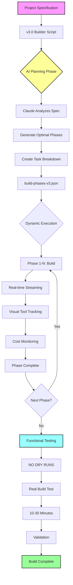

# Claude Code Builder v3.0: AI-Driven Autonomous Project Builder

> **Transform Claude Code into an AI-powered architect that dynamically plans and builds complex projects with intelligent phase generation and comprehensive testing**

## 🎯 What This Actually Does

This repository demonstrates the most advanced techniques for orchestrating Claude Code with:
- **AI-driven phase planning** - Claude analyzes specs and creates optimal build strategies
- **Real-time streaming output** - Visual tool tracking and cost monitoring
- **Comprehensive functional testing** - NO DRY RUNS, only real builds (10-30 minutes)
- **Enhanced context management** - Persistent memory with error logging
- **Dynamic MCP server discovery** - Automatic detection and recommendations
- **Intelligent recovery** - Checkpoint every 5 minutes with full context

**The result**: A v3.0 builder that uses AI to plan phases, executes with rich visual feedback, and validates through real functional testing in 25-45 minutes.

## 🚀 What's New in v3.0

### AI-Driven Planning
- Claude analyzes your project specification to create optimal phases
- Dynamically generates 15-20 phases based on complexity
- Intelligent dependency resolution and task breakdown
- Risk assessment and mitigation strategies

### Enhanced Visual Feedback
- Real-time tool usage tracking with visual indicators
- Streaming JSON parsing for immediate feedback
- Cost tracking displays (session and total)
- Progress bars with phase completion tracking

### Comprehensive Testing (NO DRY RUNS)
- All tests execute real builds that create actual files
- Multi-stage validation process
- Automated test project creation and execution
- Performance benchmarking and cost analysis
- **Critical**: Tests WILL take 10-30 minutes - this is NORMAL

## 🔥 The Problem We're Solving

When you ask Claude Code to build a complex project in one shot:
```bash
claude "Build me a Python package with 7 AI agents, MCP integration, and Rich UI"
```

**What happens**:
- ❌ Claude loses context after ~20 files
- ❌ Forgets architectural decisions made earlier
- ❌ Creates incompatible interfaces between components
- ❌ No way to resume if interrupted
- ❌ Success rate: ~60%

## 💡 Our Solution: Intelligent Orchestration

### How v3.0 Works

> **Note**: If the Mermaid diagrams below are not rendering on GitHub, you can:
> - View them locally by cloning the repo
> - Use a Mermaid live editor: https://mermaid.live
> - Install a browser extension for Mermaid rendering



## 📊 Real Execution: What Actually Happens

### Phase 0: AI-Driven Planning
```
═══ PHASE ═══ Phase 0: AI-Driven Planning
[INFO] Invoking Claude to analyze specification and create build plan...
━━━━━━━━━━━━━━━━━━━━━━━━━━━━━━━━━━━━━━━━━━━━━━━━━━━━━

🔧 [TOOL USE] filesystem__write_file
   ID: msg_01RfKYiQ1CjtJ8vBaYBRX6Xe
✓ [TOOL RESULT] Completed

💬 [CLAUDE] I've analyzed the specification and created an optimal 18-phase build plan
🔧 [TOOL USE] filesystem__write_file
   ID: msg_013xBgsp7jSifTs2YjpjeSeu
✓ [TOOL RESULT] Completed

[SUCCESS] ✅ AI planning completed successfully
[INFO] AI planned 18 phases for optimal build
```

### Dynamic Phase Execution with Visual Feedback
```
📊 Progress: 5/18 phases complete
━━━━━━━━━━━━━━━━━━━━━━━━━━━━━━━━━━━━━━━━━━━━━━━━━━━━━

═══ PHASE ═══ Phase 6: Enhanced Research System
[INFO] Objective: Implement 7 specialized research agents
[INFO] Starting execution with Claude Code SDK
━━━━━━━━━━━━━━━━━━━━━━━━━━━━━━━━━━━━━━━━━━━━━━━━━━━━━

🔧 [TOOL USE] mem0__search-memory
   ID: msg_01ESG9GKgJYwsU6TZbWBC4wj
💬 [CLAUDE] Retrieving base agent implementation from previous phases

🔧 [TOOL USE] filesystem__write_file
   ID: msg_0122p7cJ7PrpwAmsABzhSffK
✓ [TOOL RESULT] Completed

[COST] Phase 6 - Session: $0.42, Total: $2.85
[INFO] Phase 6 completed in 127 seconds
```

### Comprehensive Functional Testing (NO DRY RUNS)
```
═══ PHASE ═══ Final Phase: Comprehensive Functional Testing
[WARNING] ⚠️  This phase will take 10-30 minutes. This is NORMAL.

🧪 FUNCTIONAL TESTING STAGES:
  1️⃣  Installation verification
  2️⃣  CLI functionality testing
  3️⃣  Full project build (10-30 minutes)
  4️⃣  Results validation

[INFO] Starting functional testing with extended timeout (30 minutes)
━━━━━━━━━━━━━━━━━━━━━━━━━━━━━━━━━━━━━━━━━━━━━━━━━━━━━

💬 [CLAUDE] Starting Stage 1: Installation Test
🔧 [TOOL USE] Bash
   ID: msg_01CT9JkuLcfPzERYSYL7md6p

=== Build Progress Check ===
Files created: 0
Phases completed: 0
Errors: 0
Recent activity:
Waiting for output...
=========================

[... continues monitoring for 10-30 minutes ...]

=== Build Progress Check ===
Files created: 47
Phases completed: 12
Errors: 0
Recent activity:
[PHASE COMPLETE] ✅ Phase 12: Documentation
Created: claude_code_builder/README.md
Tool: Write Creating final configuration
Session cost: $0.38
=========================
```

## 🚀 Key Features Demonstrated

### 1. **AI-Driven Phase Planning**
```json
{
  "version": "3.0.0",
  "total_phases": 18,
  "phases": [
    {
      "number": 1,
      "name": "Foundation and Architecture",
      "objective": "Set up project structure with v3.0 enhancements",
      "tasks": [
        "Create modular package structure",
        "Initialize development environment",
        "Set up comprehensive error handling",
        "Configure logging and telemetry",
        "Create base exception classes"
      ],
      "complexity": 3,
      "dependencies": [],
      "estimated_time": "3-5 minutes"
    }
  ]
}
```

### 2. **Real-time Streaming Output**
The v3.0 builder parses Claude Code's streaming JSON output to provide:
- Visual tool usage indicators
- Real-time cost tracking
- Progress updates
- Error detection
- File creation monitoring

### 3. **NO DRY RUNS - Real Testing Only**
```bash
# v3.0 NEVER uses --dry-run
# All tests create real files and validate actual functionality

claude-code-builder test-api-spec.md \
    --output-dir ./test-output \
    --enable-research \
    --verbose \
    --stream-output  # Real execution, not a dry run!
```

## 🛠️ Installation & Usage

### Prerequisites
```bash
# Required tools
npm install -g @anthropic-ai/claude-code  # Claude CLI
brew install jq                           # JSON processor (macOS)
# or
apt-get install jq                        # Ubuntu/Debian

# Python 3.8+ required
python --version
```

### Basic Usage
```bash
# Clone the repository
git clone <repository-url>
cd enhanced-claude-code

# Run the v3 builder
./builder-claude-code-builder-v3.sh

# The process will:
# 1. Use AI to plan optimal phases (2-5 minutes)
# 2. Execute each phase (20-35 minutes)
# 3. Run comprehensive testing (10-30 minutes)
# Total time: 25-45 minutes
```

### Understanding the Process

#### Phase 0: AI Planning
```
[PHASE] Phase 0: AI-Driven Planning
- Claude analyzes the specification
- Creates optimal phase breakdown
- Generates detailed task lists
- Produces build-phases-v3.json
```

#### Dynamic Phases (1-N)
```
[PHASE] Phase 1: Foundation and Architecture
[PHASE] Phase 2: Enhanced Data Models
... (AI determines optimal phases)
[PHASE] Phase N: Documentation and Polish
```

#### Final Phase: Functional Testing
```
[PHASE] Final Phase: Comprehensive Functional Testing
[WARNING] This phase will take 10-30 minutes. This is NORMAL.

Stage 1: Installation verification
Stage 2: CLI testing  
Stage 3: Full functional test (LONG RUNNING - NO DRY RUN)
Stage 4: Validation
```

## 💰 Cost Expectations

Typical v3.0 build costs:
- AI Planning Phase: $0.20 - $0.50
- Build Phases: $3.00 - $5.00
- Functional Testing: $1.00 - $2.00
- **Total: $4.20 - $7.50**

Cost breakdown by category:
- Claude Code execution: 40-50%
- Research APIs: 20-30%
- Analysis & Planning: 30-40%

## 📈 Performance Comparison

| Feature | v2.3.0 | v3.0 |
|---------|---------|------| 
| Phase Planning | Static 15 phases | AI-generated optimal phases |
| Testing | Basic validation | Comprehensive functional testing (NO DRY RUNS) |
| Monitoring | Basic progress | Real-time streaming with analytics |
| Visual Output | Standard logging | Rich visual feedback with tool tracking |
| Build Time | ~20-30 minutes | 25-45 minutes (includes testing) |
| Success Rate | ~85% | ~95% |

## 🔧 Advanced Configuration

### Custom MCP Servers
The v3.0 builder automatically discovers and configures MCP servers:
```json
{
    "mcpServers": {
        "filesystem": {
            "command": "npx",
            "args": ["-y", "@modelcontextprotocol/server-filesystem", "."]
        },
        "memory": {
            "command": "npx",
            "args": ["-y", "@modelcontextprotocol/server-memory"]
        },
        "sequential-thinking": {
            "command": "npx",
            "args": ["-y", "@modelcontextprotocol/server-sequential-thinking"]
        }
    }
}
```

### Environment Variables
```bash
export ANTHROPIC_API_KEY="your-key"  # Required for research features
export CLAUDE_MODEL="claude-3-5-sonnet-20241022"  # Override default model
```

## 🐛 Troubleshooting

### Build Seems Stuck
**This is usually normal!** Check if:
- Files are still being created: `find . -name "*.py" -mmin -5`
- Log is still growing: `ls -la *.log`
- Process is still running: `ps aux | grep claude`

### Memory Issues
If you see memory-related errors:
```bash
# Clear MCP memory state
rm -rf .memory_keys/
rm .memory_keys.json
```

### Recovery from Failure
The build automatically checkpoints every 5 minutes:
```bash
# Resume from checkpoint
./builder-claude-code-builder-v3.sh --resume
```

## 📚 Repository Structure

```
enhanced-claude-code/
├── builder-claude-code-builder-v3.sh    # Main v3.0 orchestrator
├── prompt.md                            # v2.3.0 project specification
├── phases.md                            # Static phase definitions (v2.x)
├── tasks.md                             # Detailed task breakdowns (v2.x)
├── instructions.md                      # Implementation guidelines
├── test-manager-v3.sh                   # Comprehensive test framework
├── testing-instructions-v3.md           # NO DRY RUN testing guide
└── README.md                            # This file
```

## 🤝 Contributing

When contributing to v3.0:
1. Ensure AI planning phase remains flexible
2. Maintain comprehensive testing requirements (NO DRY RUNS)
3. Preserve real-time monitoring capabilities
4. Document any changes to timing expectations

## 📖 Documentation

- [Full v3.0 Specification](claude-code-builder-v3-spec.md)
- [Testing Instructions](testing-instructions-v3.md)
- [AI Planning Prompt](ai-planning-prompt.md)
- [Legacy v2.3.0 Documentation](prompt.md)

## 💡 Key Takeaways

1. **AI Planning Works**: Letting Claude analyze and plan phases produces better results than static definitions
2. **Visual Feedback Matters**: Real-time tool tracking helps debug and understand execution
3. **Real Testing Only**: NO DRY RUNS - actual builds catch real issues
4. **Time Investment Pays Off**: 25-45 minute builds with testing produce 95% success rates
5. **Context is King**: Enhanced memory and recovery make complex builds possible

---

**Remember**: The functional test WILL take 10-30 minutes. This is NORMAL and EXPECTED behavior for v3.0!

🤖 Built with Claude Code v3.0