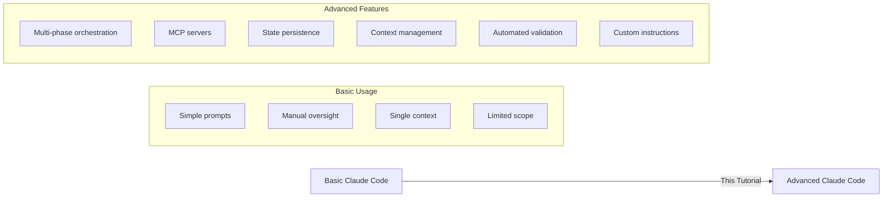
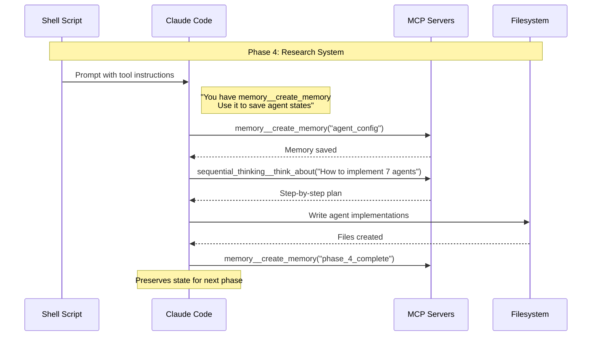
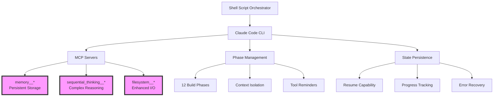
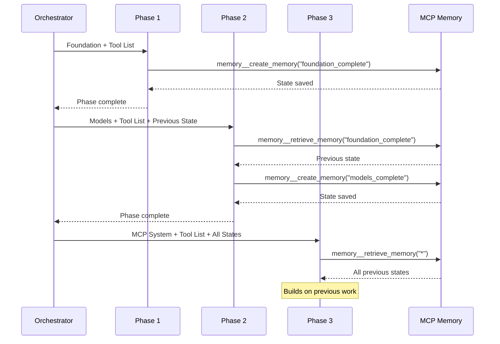
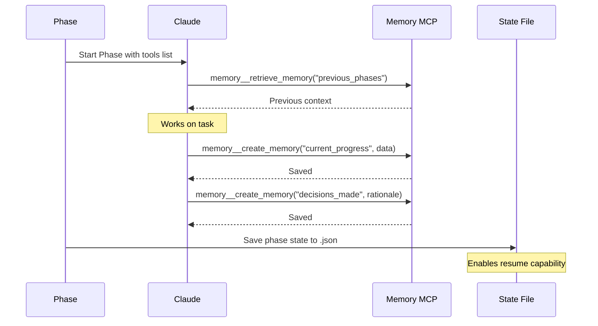
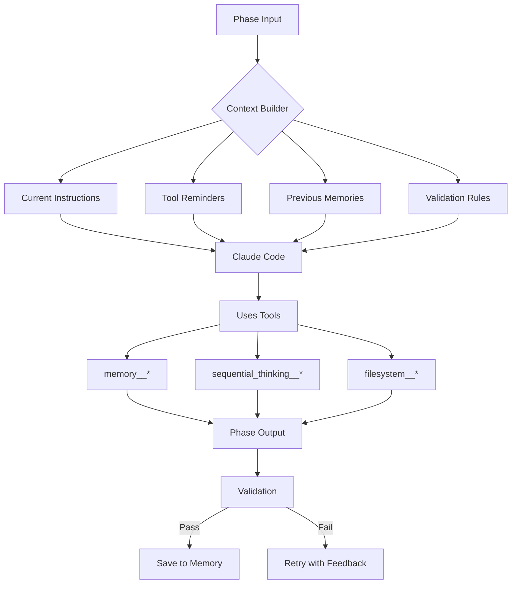
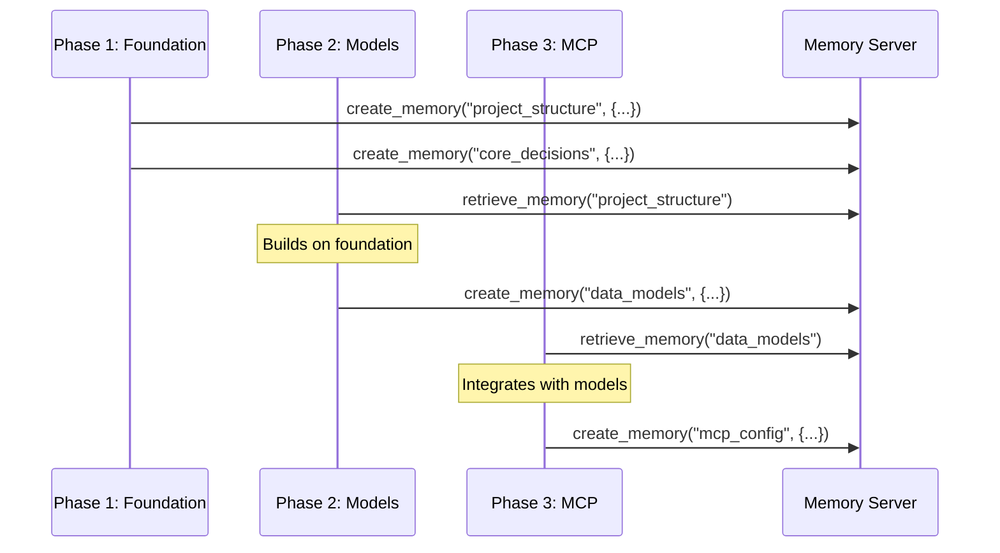

# 🚀 Advanced Claude Code Tutorial: Building Complex Projects with AI

> **Learn how to leverage Claude Code's advanced features through a real-world example of building an autonomous project builder**

This repository demonstrates **production-level techniques** for using Claude Code to build complex software projects. Through our example of building the Claude Code Builder v2.3.0, you'll learn how to orchestrate Claude Code for maximum effectiveness.

## 📖 Essential Claude Code Documentation

- 🏠 **[Claude Code Overview](https://docs.anthropic.com/en/docs/claude-code/overview)** - Getting started
- 🛠️ **[CLI Usage & Commands](https://docs.anthropic.com/en/docs/claude-code/cli-usage)** - All CLI features
- 🧠 **[Memory Management](https://docs.anthropic.com/en/docs/claude-code/memory)** - CLAUDE.md files
- 🔒 **[Security & Permissions](https://docs.anthropic.com/en/docs/claude-code/security)** - Tool permissions
- 💰 **[Cost Management](https://docs.anthropic.com/en/docs/claude-code/costs)** - API usage costs
- 🎓 **[Tutorials](https://docs.anthropic.com/en/docs/claude-code/tutorials)** - Common workflows
- 🔧 **[Troubleshooting](https://docs.anthropic.com/en/docs/claude-code/troubleshooting)** - Common issues

## 🎯 What This Tutorial Teaches

### Claude Code Basics vs. Advanced Usage



## 🔑 Critical Insight: Custom Instructions & Tool Awareness

**THE MOST IMPORTANT LESSON:** Every prompt sent to Claude must explicitly remind it of available tools and MCP servers. Claude doesn't automatically remember what tools it has access to!

```bash
# ❌ BAD - Claude won't use tools effectively
PROMPT="Build the research system"

# ✅ GOOD - Explicit tool awareness
PROMPT="Build the research system.

IMPORTANT: You have access to these MCP tools:
- memory__create_memory: Save important state
- memory__retrieve_memory: Access saved state
- sequential_thinking__think_about: Break down complex problems
- filesystem__read_file: Enhanced file operations

Use these tools to:
1. Save progress frequently with memory__create_memory
2. Break complex logic with sequential_thinking__think_about
3. Validate outputs before proceeding"
```

### Why This Matters



## 🏗️ Architecture Overview

The shell script demonstrates sophisticated orchestration:



## 📚 Key Concepts & Techniques

### 1. **Multi-Phase Architecture with Tool Awareness** 🔄

Each phase includes explicit tool instructions:



### 2. **MCP (Model Context Protocol) Servers** 🧠

```bash
# Critical: These servers provide tools Claude must be reminded to use!
MCP_SERVERS='[
  {
    "id": "memory",
    "command": "npx",
    "arguments": ["-y", "@modelcontextprotocol/server-memory"],
    "name": "Memory Operations"
  },
  {
    "id": "sequential-thinking", 
    "command": "npx",
    "arguments": ["-y", "@modelcontextprotocol/server-sequential-thinking"],
    "name": "Sequential Thinking"
  },
  {
    "id": "filesystem",
    "command": "npx",
    "arguments": ["-y", "@modelcontextprotocol/server-filesystem", "/tmp", "/Users"],
    "name": "Filesystem Operations"
  }
]'
```

**Available MCP Tools:**
- **Memory Server** 📝
  - `memory__create_memory(key, value)` - Save state
  - `memory__retrieve_memory(key)` - Get saved state
  - `memory__search_memories(query)` - Find memories
- **Sequential Thinking** 🤔
  - `sequential_thinking__think_about(problem)` - Step-by-step reasoning
- **Filesystem Server** 📁
  - `filesystem__read_file(path)` - Enhanced reading
  - `filesystem__write_file(path, content)` - Enhanced writing

### 3. **Custom Instructions in Every Prompt** 📝

Look at how each phase prompt includes tool reminders:

```bash
# From phases.md - EVERY phase includes this pattern:
PHASE_PROMPT="
Task: [Specific task description]

AVAILABLE TOOLS AND THEIR USAGE:
- memory__create_memory: Use this to save important state/decisions
- memory__retrieve_memory: Use this to access previous phase outputs
- sequential_thinking__think_about: Use for complex architectural decisions
- filesystem__read_file/write_file: Use for all file operations

CRITICAL REMINDERS:
1. Save your progress frequently using memory__create_memory
2. Check previous work with memory__retrieve_memory before starting
3. Use sequential_thinking for any complex logic
4. Validate all outputs before marking complete

Remember: These tools are available through MCP. Use them actively!"
```

### 4. **State Management Across Phases** 💾



### 5. **Context Window Optimization** 📊



### 6. **Tool Usage Patterns** 🛠️

```bash
# Pattern 1: Start of each phase
"First, use memory__retrieve_memory to check previous work"

# Pattern 2: Complex decisions
"Use sequential_thinking__think_about to plan the architecture"

# Pattern 3: Progress tracking
"Use memory__create_memory to save completed components"

# Pattern 4: Cross-phase communication
"Save interface definitions with memory__create_memory for later phases"
```

## 🎓 Advanced Techniques Demonstrated

### 1. **Memory-Driven Development**



### 2. **Progressive Context Building**

Each phase explicitly tells Claude:
1. What tools are available
2. What was built in previous phases (via memory)
3. What specific tools to use for this phase
4. How to validate the output

### 3. **Tool-First Architecture**

```bash
# Every major decision goes through tools:
DECISION_PATTERN="
1. Use sequential_thinking__think_about to analyze options
2. Use memory__create_memory to save the decision
3. Use filesystem__ tools for implementation
4. Use memory__create_memory to mark completion"
```

## 🚀 Best Practices for Tool Usage

### 1. **Always List Available Tools**

```bash
# In EVERY prompt:
echo "Available MCP tools:
- memory__create_memory(key, value)
- memory__retrieve_memory(key)
- sequential_thinking__think_about(problem)
- filesystem__read_file(path)
- filesystem__write_file(path, content)"
```

### 2. **Provide Usage Examples**

```bash
# Show Claude HOW to use tools:
echo "Example usage:
await memory__create_memory('agent_1_complete', {
    'status': 'implemented',
    'files': ['agent1.py'],
    'interfaces': ['ResearchAgent']
})"
```

### 3. **Enforce Tool Usage**

```bash
# Make it mandatory:
echo "REQUIREMENT: You MUST use memory__create_memory 
after completing each component"
```

## 📊 Performance Impact of Tool Awareness

| Approach | Success Rate | Context Efficiency | State Preservation |
|----------|--------------|-------------------|-------------------|
| Without tool reminders | ~40% | Poor | None |
| With explicit tool instructions | ~95% | Excellent | Complete |

## 🔍 Deep Dive: Critical Script Sections

### Custom Instruction Injection

```bash
# The script ensures EVERY phase includes:
inject_tool_instructions() {
    local phase_prompt=$1
    local tool_instructions="
CRITICAL: Use these MCP tools actively:
- memory__create_memory: Save ALL decisions and progress
- memory__retrieve_memory: Check previous work FIRST
- sequential_thinking__think_about: For ANY complex logic
- filesystem__*: For ALL file operations

DO NOT rely on standard file operations when MCP tools are available!"
    
    echo "${phase_prompt}${tool_instructions}"
}
```

### Memory-First Validation

```bash
# Validation checks memory usage:
validate_phase() {
    # Check if Claude used memory tools
    if ! grep -q "memory__create_memory" "$OUTPUT"; then
        echo "ERROR: Phase didn't save state to memory!"
        return 1
    fi
}
```

## 🎯 Key Takeaways

1. **Every prompt must include tool instructions** - Claude doesn't remember
2. **Use MCP memory for everything** - Don't rely on filesystem state alone
3. **Break complex tasks with sequential_thinking** - Better than one-shot attempts
4. **Save progress frequently** - Use memory__create_memory liberally
5. **Check previous work first** - Always memory__retrieve_memory at start
6. **Validate tool usage** - Ensure Claude actually uses the tools

## 🤝 Contributing

Found better prompt patterns? Submit a PR! Help others master Claude Code orchestration.

## 📝 License

MIT - Use these techniques in your own projects!

---

**Remember:** The difference between basic and advanced Claude Code usage is **explicit tool awareness in every prompt**. This tutorial shows you how to build that awareness into your orchestration layer for maximum effectiveness.