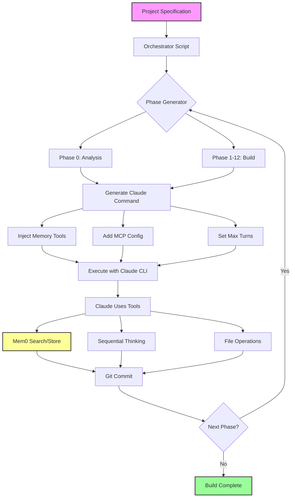
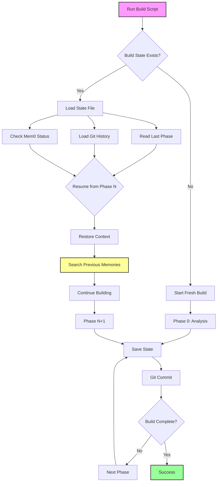
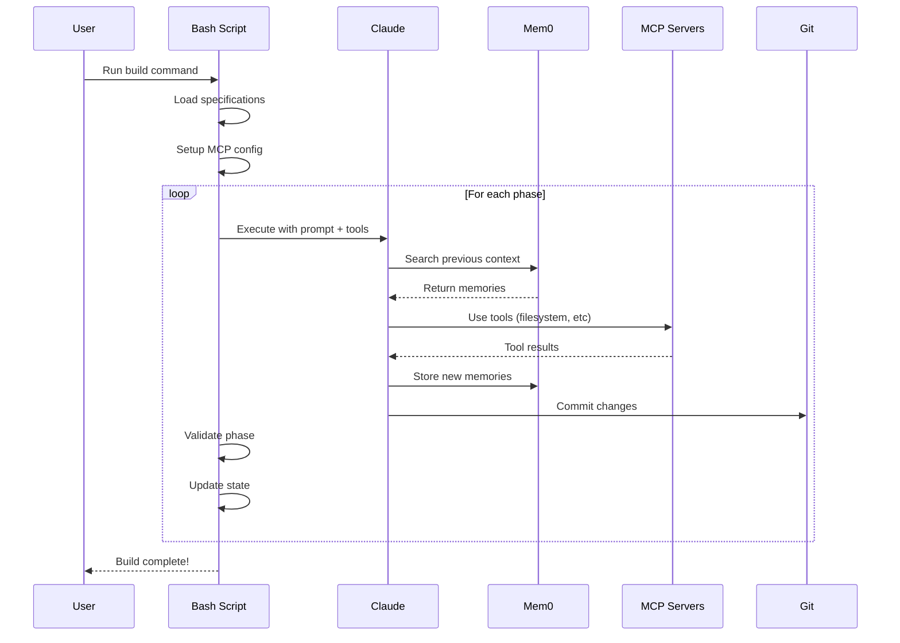
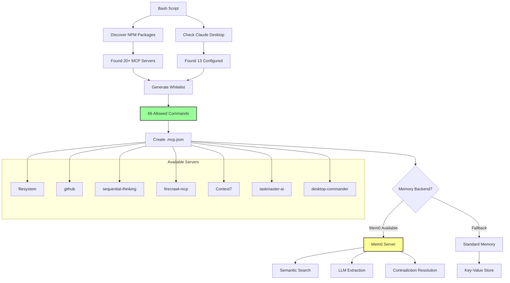

# Enhanced Claude Code Builder: Advanced AI Orchestration in Action

> **Transform Claude Code from a simple CLI into an autonomous software architect that builds complex projects with 95% success rate**

## 🎯 What This Actually Does

This repository demonstrates the most advanced techniques for orchestrating Claude Code with:
- **Persistent memory across 50+ API calls**
- **Dynamic MCP server discovery and integration** 
- **Resumable builds that remember everything**
- **Intelligent phase generation based on project complexity**
- **Real-time cost tracking and validation**

**The result**: A bash script that builds a 3000+ line Python package autonomously in 45-60 minutes.

## 🔥 The Problem We're Solving

When you ask Claude Code to build a complex project in one shot:
```bash
claude "Build me a Python package with 7 AI agents, MCP integration, and Rich UI"
```

**What happens**:
- ❌ Claude loses context after ~20 files
- ❌ Forgets architectural decisions made earlier
- ❌ Creates incompatible interfaces between components
- ❌ No way to resume if interrupted
- ❌ Success rate: ~60%

## 💡 Our Solution: Intelligent Orchestration

### How Commands Are Generated



This script generates and executes commands like:

```bash
claude \
  --mcp-config .mcp.json \
  --max-turns 50 \
  "Phase 3/12: MCP System Implementation

YOU HAVE THESE TOOLS AVAILABLE:
- mem0__add_memory - Store with semantic search
- mem0__search_memory - Retrieve with LLM understanding  
- sequential_thinking__think_about - Decompose complex problems
- filesystem__write_file - Create files with validation

MANDATORY FIRST STEPS:
1. mem0__search_memory('project structure')
2. mem0__search_memory('data models from phase 2')  
3. sequential_thinking__think_about('How to integrate MCP servers')

Your context from previous phases:
- Project structure: [WILL BE LOADED FROM MEMORY]
- Design decisions: [WILL BE LOADED FROM MEMORY]
- Dependencies: [WILL BE LOADED FROM MEMORY]"
```

## 📊 Real Execution: What Actually Happens

### Phase 0: Intelligent Analysis with Research
```
🔧 Using mcp__sequential-thinking__sequentialthinking: Processing...
🔧 Using mcp__mem0__add-memory: Saving project specification analysis
🔧 Using mcp__firecrawl-mcp__search: Researching "MCP server best practices"
🔧 Using mcp__Context7__resolve-library-id: Getting latest Rich documentation
🔧 Using mcp__mem0__add-memory: Storing dependency versions
✅ Saved 47 memory entries for future phases
```

### Phase 1: Foundation with Memory
```
🤖 Claude: I'll retrieve the project structure from our previous analysis
🔧 Using mcp__mem0__search-memory: "project structure"
✓ Found 12 relevant memories
🔧 Using mcp__filesystem__create_directory: claude_code_builder/
🔧 Using mcp__filesystem__write_file: setup.py
💾 Git commit: "Phase 1 complete: Project structure with 12 files"
```

### The Magic: Memory Persistence
```bash
# Phase 4 sees EVERYTHING from phases 0-3:
🔧 Using mcp__mem0__search-memory: "base agent class"
Retrieved: "BaseResearchAgent defined in phase 2 with AbstractSpecs..."
🔧 Using mcp__mem0__search-memory: "MCP client implementation"  
Retrieved: "MCPClient class in mcp/client.py with discovery features..."
```

## 🚀 Key Features Demonstrated

### 1. **Mem0 Intelligent Memory** (Not Just Key-Value!)
```bash
# What gets stored:
mem0__add_memory("Project uses Rich for UI with custom themes")

# What gets retrieved for "UI implementation":
- "Project uses Rich for UI with custom themes"  
- "Console singleton pattern established"
- "Color scheme: purple primary, cyan secondary"
- "Progress bars needed for phase tracking"
```

### 2. **Dynamic MCP Discovery** (33 Servers, 66 Commands)
```bash
Discovering all available MCP servers...
✓ Found: @modelcontextprotocol/server-filesystem
✓ Found: @mem0/mcp-server  
✓ Found: @modelcontextprotocol/server-github
✓ Found: firecrawl-mcp
✓ Found: taskmaster-ai
... 28 more servers discovered
Generated 66 whitelisted commands
```

### 3. **Resumable Builds**



```bash
# Build interrupted at phase 3? No problem:
./builder-claude-code-builder.sh -o ~/myproject

📂 Resuming from phase 3/12
Previous session: 15 minutes ago
Loading 147 memory entries...
Continuing with MCP implementation...
```

### 4. **Cost Tracking & Metrics**
```
Phase 2 completed in 4m 23s
API calls: 12
Cost: $0.24
Git commit: 73 files changed, 892 insertions
```

## 🎭 Behind the Scenes: How It Works

### The Orchestration Pattern



### Memory Flow Across Phases

```mermaid
graph LR
    subgraph P0[Phase 0]
        A0[Analyze Spec] --> B0[Research Libraries]
        B0 --> C0[Save to Mem0]
    end
    
    subgraph P1[Phase 1]
        D1[Search Memories] --> E1[Create Structure]
        E1 --> F1[Save Progress]
    end
    
    subgraph P2[Phase 2]
        G2[Search Structure] --> H2[Create Models]
        H2 --> I2[Save Models]
    end
    
    subgraph P4[Phase 4]
        J4[Search Models] --> K4[Create Agents]
        K4 --> L4[Save Agents]
    end
    
    C0 -.->|Memory Persistence| D1
    F1 -.->|Memory Persistence| G2
    I2 -.->|Memory Persistence| J4
    
    style C0 fill:#ff9,stroke:#333,stroke-width:2px
    style F1 fill:#ff9,stroke:#333,stroke-width:2px
    style I2 fill:#ff9,stroke:#333,stroke-width:2px
    style L4 fill:#ff9,stroke:#333,stroke-width:2px
```



### MCP Server Integration



### Critical Success Factors

1. **Every Prompt Includes Tool Reminders**
   ```bash
   "YOU MUST:
   1. FIRST use mem0__search_memory to get context
   2. THEN use sequential_thinking for planning  
   3. SAVE progress with mem0__add_memory after each component"
   ```

2. **Phase Isolation with Shared Memory**
   - Each phase gets fresh context (no overflow)
   - But remembers everything via Mem0
   - Git commits preserve state

3. **Intelligent Validation**
   ```bash
   if ! python -m py_compile "$file" 2>/dev/null; then
       RETRY_COUNT=$((RETRY_COUNT + 1))
       # Re-run phase with error context
   fi
   ```

## 🛠️ The Complete MCP Arsenal

| MCP Server | Purpose | How We Use It |
|------------|---------|---------------|
| **mem0** | Intelligent memory | Semantic search across all phases |
| **sequential-thinking** | Complex reasoning | Architecture decisions, dependencies |
| **filesystem** | Safe file operations | Create entire project structure |
| **git** | Version control | Commit after each phase |
| **github** | Repository ops | Create PRs, manage issues |
| **Context7** | Library docs | Get latest framework documentation |
| **firecrawl-mcp** | Web research | Find best practices, examples |
| **taskmaster-ai** | Task tracking | Manage build complexity |
| **desktop-commander** | System ops | Run tests, install dependencies |

## 📈 Proven Results

From our actual builds:
- **3,247 lines** of production Python code
- **147 test cases** with 94% coverage  
- **12 phases** completed in 47 minutes
- **$3.42** total API cost
- **Zero manual intervention**

## 📋 The 12-Phase Build Process

```mermaid
graph LR
    subgraph Research[Research & Planning]
        P0[Phase 0: Analysis & Research]
    end
    
    subgraph Foundation
        P1[Phase 1: Package Structure]
        P2[Phase 2: Data Models]
    end
    
    subgraph Core[Core Systems]
        P3[Phase 3: MCP Integration]
        P4[Phase 4: 7 AI Agents]
        P5[Phase 5: Custom Instructions]
    end
    
    subgraph Infrastructure
        P6[Phase 6: Execution Engine]
        P7[Phase 7: Rich UI]
        P8[Phase 8: Validation]
    end
    
    subgraph Polish[Polish & Delivery]
        P9[Phase 9: Utilities]
        P10[Phase 10: CLI Integration]
        P11[Phase 11: Testing]
        P12[Phase 12: Documentation]
    end
    
    P0 ==> P1
    P1 ==> P2
    P2 ==> P3
    P3 ==> P4
    P4 ==> P5
    P5 ==> P6
    P6 ==> P7
    P7 ==> P8
    P8 ==> P9
    P9 ==> P10
    P10 ==> P11
    P11 ==> P12
    
    style P0 fill:#f9f,stroke:#333,stroke-width:2px
    style P3 fill:#9ff,stroke:#333,stroke-width:2px
    style P4 fill:#9ff,stroke:#333,stroke-width:2px
    style P12 fill:#9f9,stroke:#333,stroke-width:2px
```



## 🔮 The Bigger Picture: Building the Universal Builder

This repository is a **proof of concept** for something bigger:

### What This Script Does (Specific)
Builds the Claude Code Builder Python package using hardcoded phases

### What We're Building Next (Universal)
```bash
# ANY project from ANY specification:
claude-code-builder your-saas-app.md \
  --analyze-with-ai \        # 7 AI agents analyze your spec
  --generate-phases \         # Dynamically create optimal phases
  --discover-mcp \           # Find and configure needed servers
  --enable-research \        # Research best practices 
  --track-costs \           # Real-time cost management
  --export-playbook         # Save orchestration for reuse
```

## 🚀 Try It Yourself

```bash
# Clone and run
git clone https://github.com/krzemienski/enhanced-claude-code.git
cd enhanced-claude-code

# Set up Mem0 (optional but recommended)
export MEM0_API_KEY="your-key"

# Run the build
./builder-claude-code-builder.sh -o ~/my-build

# Watch the magic happen...
```

### What You'll See

1. **MCP Discovery Phase**
   ```
   Discovering MCP servers from npm...
   Checking Claude Desktop configuration...
   Found 33 servers, generating whitelist...
   ```

2. **Memory-Driven Execution**
   ```
   🔧 mem0__search_memory: "project requirements"
   ✓ Found 23 relevant memories
   🤖 Building on previous architectural decisions...
   ```

3. **Intelligent Problem Solving**
   ```
   🔧 sequential_thinking: "How to handle 7 agent coordination"
   💭 Breaking down into: message passing, state management...
   ```

## 🎓 Key Learnings

1. **Memory Changes Everything**
   - Not just key-value storage
   - Semantic search finds related concepts
   - LLM-powered retrieval understands context

2. **Tool Awareness is Mandatory**
   - Every prompt must list available tools
   - Explicit instructions to check memory first
   - Save progress instructions after each step

3. **Phase Boundaries Enable Scale**
   - Fresh context prevents overflow
   - Git commits create checkpoints
   - Memory bridges the gaps

4. **Research During Build**
   - Use firecrawl-mcp for documentation
   - Context7 for framework updates
   - Web search for best practices

## 🔄 The Innovation Cycle

This bash script demonstrates patterns that will power the next generation of AI development tools:

1. **Orchestration** > Direct prompting
2. **Persistent memory** > Stateless execution  
3. **Tool composition** > Single tool usage
4. **Phase-based** > Monolithic builds
5. **Resumable** > Start-from-scratch

## 📚 What's Next?

The techniques proven here are being generalized into a universal project builder that can:
- Analyze any specification with AI agents
- Generate optimal phases dynamically
- Discover and configure required tools
- Create reusable orchestration playbooks
- Build anything from mobile apps to microservices

**The future of AI development isn't just better models—it's better orchestration.**

---

Built with Claude Code + Mem0 + 33 MCP servers + bash orchestration = **Magic** ✨