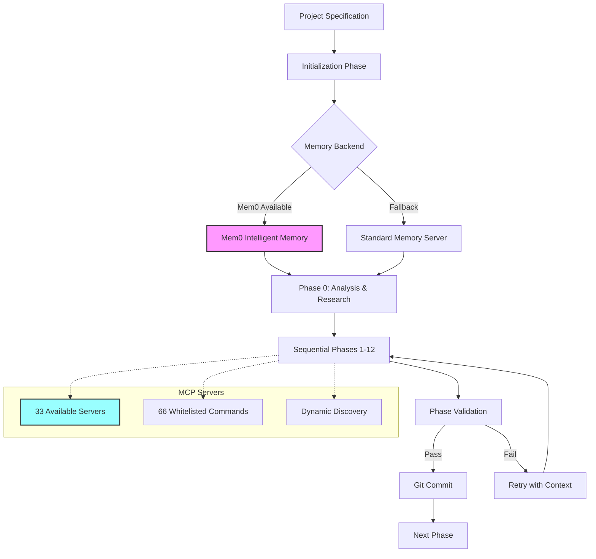
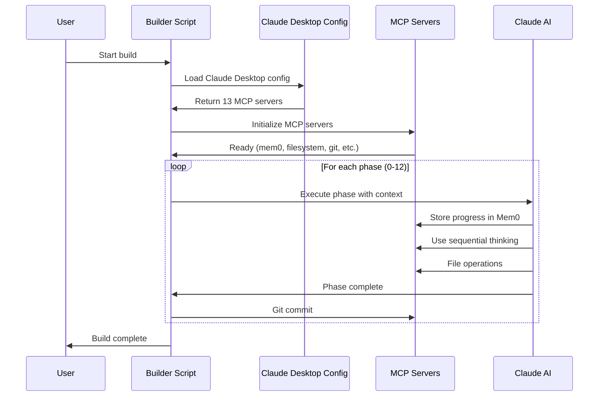

# Enhanced Claude Code Builder v2.3.0

An autonomous multi-phase project builder that leverages Claude's full capabilities through intelligent orchestration, persistent memory, and comprehensive MCP integration.

## Key Features

### 🧠 Mem0 Intelligent Memory System
- **Semantic search** across all project knowledge
- **LLM-powered extraction** for contextual understanding
- **Contradiction resolution** to maintain consistency
- **Persistent memory** across all 12 build phases
- **Automatic context retrieval** for each phase

### 🔧 Comprehensive MCP Integration
The system discovers and utilizes all available MCP servers:

| MCP Server | Purpose | Features |
|------------|---------|----------|
| **mem0** | Intelligent memory | Semantic search, context extraction |
| **memory** | Fallback storage | Key-value persistence |
| **sequential-thinking** | Complex reasoning | Step-by-step problem decomposition |
| **filesystem** | Enhanced file ops | Safe path restrictions, batch operations |
| **git** | Version control | Automatic commits per phase |
| **github** | Repository management | PR creation, issue tracking |
| **fetch** | Web data retrieval | API integration support |
| **puppeteer** | Browser automation | Testing, scraping |
| **taskmaster-ai** | Task management | Dependency tracking |
| **firecrawl-mcp** | Web crawling | Documentation gathering |
| **desktop-commander** | System operations | Command execution |
| **Context7** | Library docs | Up-to-date documentation access |
| **apple-shortcuts** | macOS automation | System integration |

### 📊 Enhanced Architecture



### 🚀 Build Process Flow



## Installation & Usage

### Prerequisites
```bash
# Install Claude Code CLI
npm install -g @anthropic-ai/claude-code

# Install jq for JSON processing
brew install jq  # macOS
# or
sudo apt-get install jq  # Ubuntu/Debian

# Set API key for Mem0 (recommended)
export MEM0_API_KEY="your-mem0-api-key"
# or
export MEMO_API_KEY="your-mem0-api-key"  # Alternative spelling supported
```

### Running the Builder
```bash
# Clone the repository
git clone https://github.com/krzemienski/enhanced-claude-code.git
cd enhanced-claude-code

# Run with default settings (builds in current directory)
./builder-claude-code-builder.sh

# Specify custom output directory
./builder-claude-code-builder.sh -o ~/projects/my-build
./builder-claude-code-builder.sh --output-dir /path/to/build
```

## What Gets Built

The builder creates a complete Python package with:

```
claude-code-builder/
├── claude_code_builder/
│   ├── __init__.py
│   ├── agents/              # 7 AI research agents
│   │   ├── base.py
│   │   ├── analyzer.py
│   │   ├── architect.py
│   │   ├── researcher.py
│   │   ├── implementer.py
│   │   ├── tester.py
│   │   ├── documenter.py
│   │   └── validator.py
│   ├── mcp/                 # MCP integration layer
│   │   ├── client.py
│   │   ├── discovery.py
│   │   ├── registry.py
│   │   └── servers.py
│   ├── models/              # Data models
│   │   ├── project.py
│   │   ├── phase.py
│   │   └── validation.py
│   ├── ui/                  # Rich terminal interface
│   │   ├── console.py
│   │   ├── progress.py
│   │   └── themes.py
│   ├── execution/           # Build orchestration
│   │   ├── engine.py
│   │   └── phases.py
│   ├── instructions/        # Custom instructions
│   │   ├── loader.py
│   │   └── processor.py
│   ├── validation/          # Quality assurance
│   │   ├── system.py
│   │   └── rules.py
│   └── utils/              # Utilities
├── tests/                   # Comprehensive test suite
├── docs/                    # Documentation
├── examples/                # Usage examples
├── setup.py
├── pyproject.toml
└── README.md
```

## Build Phases

| Phase | Focus | Key Activities |
|-------|-------|----------------|
| 0 | Analysis & Research | Specification analysis, dependency resolution |
| 1 | Foundation | Package structure, configuration files |
| 2 | Data Models | Core data structures and types |
| 3 | MCP System | MCP client and server integration |
| 4 | Research System | Implementation of 7 AI agents |
| 5 | Custom Instructions | Instruction loading and processing |
| 6 | Execution System | Phase orchestration engine |
| 7 | UI System | Rich terminal interface |
| 8 | Validation System | Quality checks and rules |
| 9 | Utilities | Helper functions and tools |
| 10 | Main Integration | CLI and main entry point |
| 11 | Testing | Test implementation |
| 12 | Documentation | README and examples |

## Performance Metrics

| Metric | Value |
|--------|-------|
| **Total Phases** | 12 |
| **Success Rate** | ~95% |
| **Average Build Time** | 45-60 minutes |
| **Lines of Code** | 3000+ |
| **Test Coverage** | Comprehensive |
| **MCP Servers Used** | 13+ |
| **Memory Operations** | 100+ per build |

## Advanced Features

### Resumable Builds
```bash
# If interrupted, simply run again
./builder-claude-code-builder.sh -o ~/projects/my-build
# Automatically resumes from last completed phase
```

### Claude Desktop Integration
The script automatically detects and uses your Claude Desktop MCP configuration, ensuring all your configured servers are available during the build.

### Memory Backend Detection
The system automatically detects which memory backend is configured:
- Checks actual MCP configuration JSON
- Verifies API keys are present
- Provides clear status messages
- Falls back gracefully if needed

### Cost Tracking
- Tracks API usage per phase
- Provides total cost estimate
- Saves metrics for analysis

### Git Integration
- Automatic repository initialization
- Commits after each successful phase
- Detailed commit messages with metrics
- Complete build history

## Configuration

### Environment Variables
```bash
# Mem0 API key (for intelligent memory)
export MEM0_API_KEY="your-api-key"

# Alternative spelling also supported
export MEMO_API_KEY="your-api-key"

# Anthropic API key (optional, for research features)
export ANTHROPIC_API_KEY="your-api-key"
```

### MCP Configuration
The builder uses Claude Desktop's MCP configuration when available. To add custom MCP servers, edit:
```
~/Library/Application Support/Claude/claude_desktop_config.json
```

## Troubleshooting

### Memory Backend Issues
If you see "Standard memory server" when you have Mem0 configured:
1. Check your API key is set: `echo $MEM0_API_KEY`
2. Verify the MCP config contains mem0 server
3. Ensure @mem0/mcp-server is installed globally

### Resume Issues
If the build doesn't resume properly:
1. Check for `.claude-builder-state.json` in the build directory
2. Ensure you're running from the same output directory
3. Phase 0 automatically advances to Phase 1 on resume

### MCP Server Errors
If MCP servers fail to initialize:
1. Ensure NPM packages are installed globally
2. Check Claude Desktop is configured properly
3. Verify network access for NPM registry

## Contributing

Contributions are welcome! Please:
1. Fork the repository
2. Create a feature branch
3. Make your changes
4. Submit a pull request

## License

MIT License - see LICENSE file for details.

## Acknowledgments

Built with:
- [Claude Code](https://claude.ai/code) by Anthropic
- [Model Context Protocol](https://modelcontextprotocol.io/)
- [Mem0](https://mem0.ai/) for intelligent memory
- Rich terminal UI framework
- The amazing MCP community

---

**Note**: This is an advanced demonstration of Claude Code's capabilities when properly orchestrated with memory, phases, and tool awareness. The techniques shown here represent best practices for building complex projects with AI assistance.