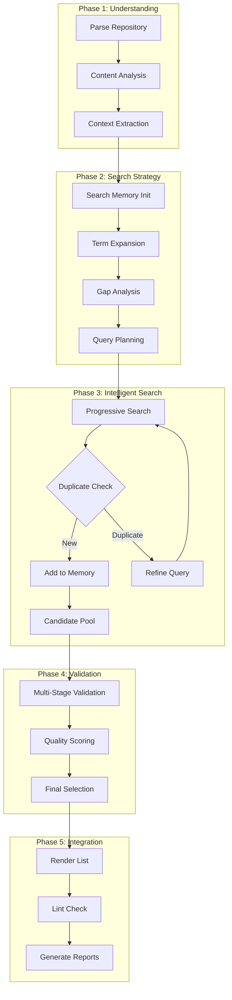
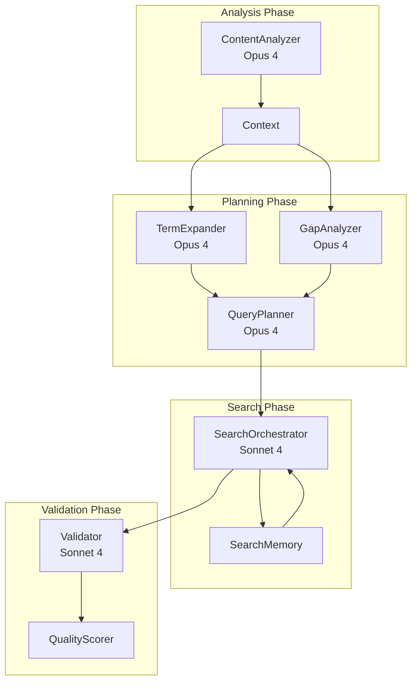

# Awesome Researcher - Complete Specification v2.0

A content-aware, zero-configuration pipeline using Anthropic Claude to intelligently discover, validate, and integrate new high-quality links into any Awesome list while avoiding duplicates through progressive search refinement.

## Table of Contents
1. [Architecture Overview](#architecture-overview)
2. [Repository Structure](#repository-structure)
3. [Core Components](#core-components)
4. [Search Intelligence System](#search-intelligence-system)
5. [Comprehensive Logging](#comprehensive-logging)
6. [Acceptance Criteria](#acceptance-criteria)
7. [Testing Framework](#testing-framework)
8. [Complete Implementation](#complete-implementation)
9. [Non-Negotiable Constraints](#non-negotiable-constraints)
10. [MCP Requirements](#mcp-requirements)

## Architecture Overview



## Repository Structure

```
awesome-researcher/
├── Dockerfile
├── build-and-run.sh
├── pyproject.toml
├── poetry.lock
├── awesome_researcher/
│   ├── __init__.py
│   ├── main.py
│   ├── config.py
│   ├── utils/
│   │   ├── __init__.py
│   │   ├── logging.py
│   │   ├── cost_tracking.py
│   │   └── helpers.py
│   ├── agents/
│   │   ├── __init__.py
│   │   ├── base_agent.py
│   │   ├── content_analyzer.py
│   │   ├── term_expander.py
│   │   ├── gap_analyzer.py
│   │   ├── query_planner.py
│   │   ├── search_orchestrator.py
│   │   └── validator.py
│   ├── core/
│   │   ├── __init__.py
│   │   ├── search_memory.py
│   │   ├── deduplication.py
│   │   ├── quality_scorer.py
│   │   └── progressive_search.py
│   ├── parsers/
│   │   ├── __init__.py
│   │   ├── awesome_parser.py
│   │   └── markdown_parser.py
│   ├── renderers/
│   │   ├── __init__.py
│   │   ├── list_renderer.py
│   │   ├── report_generator.py
│   │   └── timeline_visualizer.py
│   └── prompts/
│       ├── __init__.py
│       └── templates.py
├── tests/
│   ├── run_e2e.sh          # Primary functional test
│   ├── verify_logs.sh      # Log validation
│   ├── benchmark.sh        # Performance testing
│   └── test_multiple_repos.sh  # Multi-repo validation
├── docs/
│   ├── ARCHITECTURE.md
│   ├── README.md
│   └── TROUBLESHOOTING.md
├── CONTRIBUTING_TEMPLATE.md
├── .gitignore
├── .dockerignore
└── LICENSE
```

### Runtime Artifacts (git-ignored)
```
runs/
└── <ISO-TIMESTAMP>/
    ├── original.json
    ├── context_analysis.json
    ├── expanded_terms.json
    ├── search_memory.json
    ├── plan.json
    ├── candidate_<category>.json
    ├── new_links.json
    ├── scored_candidates.json
    ├── validated_links.json
    ├── updated_list.md
    ├── research_report.md
    ├── graph.html
    ├── agent.log
    └── logs/
        ├── pipeline.jsonl
        ├── agent.jsonl
        ├── search.jsonl
        ├── validation.jsonl
        ├── cost.jsonl
        ├── memory.jsonl
        └── errors.jsonl
```

## Core Components

### 1. Enhanced Base Agent with Logging

```python
# awesome_researcher/agents/base_agent.py
"""Enhanced base agent with comprehensive logging and metrics."""

import json
import time
from typing import Dict, Any, List, Optional, Tuple
from datetime import datetime
from anthropic import AsyncAnthropic
from awesome_researcher.utils.logging import get_logger, log_api_call
from awesome_researcher.utils.cost_tracking import CostTracker


class BaseAgent:
    """Base class for all agents with enhanced logging and tracking."""
    
    def __init__(
        self,
        name: str,
        model: str = "claude-opus-4-20250514",
        cost_tracker: Optional[CostTracker] = None,
        temperature: float = 0.7,
        max_tokens: int = 4096
    ):
        self.name = name
        self.model = model
        self.temperature = temperature
        self.max_tokens = max_tokens
        self.client = AsyncAnthropic()
        self.cost_tracker = cost_tracker or CostTracker()
        self.logger = get_logger(f"agent.{name}")
        self._call_count = 0
        self._total_time = 0.0
    
    async def _call_claude(
        self,
        messages: List[Dict[str, str]],
        system: Optional[str] = None,
        tools: Optional[List[Dict[str, Any]]] = None,
        metadata: Optional[Dict[str, Any]] = None
    ) -> Tuple[str, Optional[List[Dict[str, Any]]], Dict[str, Any]]:
        """Make an API call with comprehensive logging and tracking."""
        
        self._call_count += 1
        call_id = f"{self.name}_{self._call_count}"
        start_time = time.time()
        
        # Log the request
        self.logger.info(f"Starting API call {call_id}", extra={
            "call_id": call_id,
            "model": self.model,
            "agent": self.name,
            "metadata": metadata or {},
            "message_count": len(messages),
            "has_tools": bool(tools),
            "has_system": bool(system)
        })
        
        try:
            # Check cost ceiling before making the call
            self.cost_tracker.check_ceiling(self.model, estimated_tokens=2000)
            
            # Prepare kwargs
            kwargs = {
                "model": self.model,
                "messages": messages,
                "max_tokens": self.max_tokens,
                "temperature": self.temperature
            }
            
            if system:
                kwargs["system"] = system
            
            if tools:
                kwargs["tools"] = tools
                kwargs["tool_choice"] = "auto"
            
            # Make the API call
            response = await self.client.messages.create(**kwargs)
            
            # Calculate timing
            elapsed_time = time.time() - start_time
            self._total_time += elapsed_time
            
            # Extract content
            text_content = ""
            tool_calls = []
            
            for content in response.content:
                if content.type == "text":
                    text_content = content.text
                elif content.type == "tool_use":
                    tool_calls.append({
                        "id": content.id,
                        "name": content.name,
                        "input": content.input
                    })
            
            # Track costs and usage
            usage_info = {
                "input_tokens": response.usage.input_tokens,
                "output_tokens": response.usage.output_tokens,
                "total_tokens": response.usage.input_tokens + response.usage.output_tokens,
                "elapsed_time": elapsed_time
            }
            
            cost = self.cost_tracker.track_usage(
                model=self.model,
                input_tokens=response.usage.input_tokens,
                output_tokens=response.usage.output_tokens,
                agent=self.name,
                metadata=metadata
            )
            
            usage_info["cost_usd"] = cost
            
            # Log the successful response
            log_api_call(
                logger=self.logger,
                call_id=call_id,
                success=True,
                usage=usage_info,
                messages=messages,
                response=text_content[:1000],  # First 1000 chars
                metadata=metadata
            )
            
            return text_content, tool_calls, usage_info
            
        except Exception as e:
            # Log the error
            elapsed_time = time.time() - start_time
            
            self.logger.error(f"API call {call_id} failed", extra={
                "call_id": call_id,
                "error": str(e),
                "error_type": type(e).__name__,
                "elapsed_time": elapsed_time,
                "agent": self.name,
                "metadata": metadata
            })
            
            raise
    
    def get_metrics(self) -> Dict[str, Any]:
        """Get agent performance metrics."""
        avg_time = self._total_time / max(self._call_count, 1)
        
        return {
            "agent": self.name,
            "model": self.model,
            "call_count": self._call_count,
            "total_time": round(self._total_time, 2),
            "average_time": round(avg_time, 2),
            "total_cost": self.cost_tracker.get_agent_cost(self.name)
        }
    
    def _parse_json_response(self, text: str) -> Any:
        """Parse JSON with error handling and logging."""
        try:
            # Remove markdown code blocks
            if "```json" in text:
                text = text.split("```json")[1].split("```")[0]
            elif "```" in text:
                text = text.split("```")[1].split("```")[0]
            
            result = json.loads(text.strip())
            
            self.logger.debug(f"Successfully parsed JSON response", extra={
                "agent": self.name,
                "json_keys": list(result.keys()) if isinstance(result, dict) else f"list[{len(result)}]"
            })
            
            return result
            
        except json.JSONDecodeError as e:
            self.logger.error(f"Failed to parse JSON response", extra={
                "agent": self.name,
                "error": str(e),
                "response_preview": text[:500]
            })
            raise
```

### 2. Search Memory System

```python
# awesome_researcher/core/search_memory.py
"""Intelligent search memory to track findings and avoid duplicates."""

import json
from typing import Dict, List, Set, Any, Optional
from dataclasses import dataclass, field
from datetime import datetime
from urllib.parse import urlparse, urlunparse
import hashlib
from awesome_researcher.utils.logging import get_logger


@dataclass
class SearchResult:
    """Represents a single search result with metadata."""
    url: str
    title: str
    description: str
    category: str
    source_query: str
    found_at: datetime = field(default_factory=datetime.utcnow)
    domain: str = field(init=False)
    canonical_url: str = field(init=False)
    content_hash: str = field(init=False)
    
    def __post_init__(self):
        """Calculate derived fields."""
        parsed = urlparse(self.url)
        self.domain = parsed.netloc
        self.canonical_url = self._canonicalize_url()
        self.content_hash = self._calculate_hash()
    
    def _canonicalize_url(self) -> str:
        """Create canonical version of URL for comparison."""
        parsed = urlparse(self.url.lower())
        # Remove www., trailing slashes, fragments, and normalize
        netloc = parsed.netloc.replace('www.', '')
        path = parsed.path.rstrip('/')
        return urlunparse((parsed.scheme, netloc, path, '', '', ''))
    
    def _calculate_hash(self) -> str:
        """Calculate content hash for similarity detection."""
        content = f"{self.title.lower()}|{self.description.lower()}"
        return hashlib.sha256(content.encode()).hexdigest()[:16]


class SearchMemory:
    """Manages search history and duplicate detection."""
    
    def __init__(self, similarity_threshold: float = 0.85):
        self.logger = get_logger("search_memory")
        self.similarity_threshold = similarity_threshold
        
        # Multiple indexes for efficient lookup
        self.results: List[SearchResult] = []
        self.url_index: Dict[str, SearchResult] = {}
        self.canonical_index: Dict[str, SearchResult] = {}
        self.domain_index: Dict[str, List[SearchResult]] = {}
        self.category_index: Dict[str, List[SearchResult]] = {}
        self.query_index: Dict[str, List[SearchResult]] = {}
        self.content_hashes: Set[str] = set()
        
        # Track what we've learned
        self.learned_patterns: Dict[str, Any] = {
            "successful_queries": {},
            "domain_quality": {},
            "category_patterns": {}
        }
        
        self.logger.info("Search memory initialized")
    
    def add_result(self, result: SearchResult) -> bool:
        """Add a search result if it's not a duplicate."""
        # Check for exact URL match
        if result.canonical_url in self.canonical_index:
            self.logger.debug(f"Duplicate URL found: {result.url}")
            return False
        
        # Check for content similarity
        if result.content_hash in self.content_hashes:
            self.logger.debug(f"Similar content found: {result.title}")
            return False
        
        # Add to all indexes
        self.results.append(result)
        self.url_index[result.url] = result
        self.canonical_index[result.canonical_url] = result
        self.content_hashes.add(result.content_hash)
        
        # Update domain index
        if result.domain not in self.domain_index:
            self.domain_index[result.domain] = []
        self.domain_index[result.domain].append(result)
        
        # Update category index
        if result.category not in self.category_index:
            self.category_index[result.category] = []
        self.category_index[result.category].append(result)
        
        # Update query index
        if result.source_query not in self.query_index:
            self.query_index[result.source_query] = []
        self.query_index[result.source_query].append(result)
        
        # Learn from successful find
        self._update_patterns(result)
        
        self.logger.info(f"Added new result: {result.title}", extra={
            "url": result.url,
            "category": result.category,
            "total_results": len(self.results)
        })
        
        return True
    
    def _update_patterns(self, result: SearchResult):
        """Update learned patterns from successful finds."""
        # Track successful queries
        if result.source_query not in self.learned_patterns["successful_queries"]:
            self.learned_patterns["successful_queries"][result.source_query] = 0
        self.learned_patterns["successful_queries"][result.source_query] += 1
        
        # Track domain quality
        if result.domain not in self.learned_patterns["domain_quality"]:
            self.learned_patterns["domain_quality"][result.domain] = {
                "count": 0,
                "categories": set()
            }
        self.learned_patterns["domain_quality"][result.domain]["count"] += 1
        self.learned_patterns["domain_quality"][result.domain]["categories"].add(result.category)
    
    def is_duplicate(self, url: str, title: str = "", description: str = "") -> bool:
        """Check if a URL or content is already in memory."""
        # Quick URL check
        result = SearchResult(
            url=url,
            title=title or "Unknown",
            description=description or "",
            category="check",
            source_query="check"
        )
        
        return (
            result.canonical_url in self.canonical_index or
            result.content_hash in self.content_hashes
        )
    
    def get_category_gaps(self, category: str, target_count: int = 10) -> Dict[str, Any]:
        """Analyze what's missing for a category."""
        current_results = self.category_index.get(category, [])
        current_count = len(current_results)
        
        # Analyze current coverage
        domains = set(r.domain for r in current_results)
        topics = set()
        for r in current_results:
            # Extract key terms from titles
            words = r.title.lower().split()
            topics.update(w for w in words if len(w) > 3)
        
        return {
            "category": category,
            "current_count": current_count,
            "needed": max(0, target_count - current_count),
            "covered_domains": list(domains),
            "covered_topics": list(topics)[:20],  # Top 20
            "successful_queries": [
                q for q, results in self.query_index.items()
                if any(r.category == category for r in results)
            ]
        }
    
    def suggest_refinements(self, category: str) -> List[str]:
        """Suggest query refinements based on what's worked."""
        gaps = self.get_category_gaps(category)
        suggestions = []
        
        # Avoid domains we've already covered heavily
        overrepresented_domains = [
            domain for domain, data in self.learned_patterns["domain_quality"].items()
            if data["count"] > 3
        ]
        
        # Find successful query patterns
        successful_patterns = []
        for query, count in self.learned_patterns["successful_queries"].items():
            if count > 0 and category.lower() in query.lower():
                successful_patterns.append(query)
        
        # Generate refinement suggestions
        if gaps["needed"] > 0:
            suggestions.append(f"Need {gaps['needed']} more results for {category}")
            
            if overrepresented_domains:
                suggestions.append(f"Exclude domains: {', '.join(overrepresented_domains[:3])}")
            
            if gaps["covered_topics"]:
                suggestions.append(f"Try variations beyond: {', '.join(gaps['covered_topics'][:5])}")
        
        return suggestions
    
    def get_summary(self) -> Dict[str, Any]:
        """Get a summary of search memory state."""
        category_summary = {}
        for cat, results in self.category_index.items():
            category_summary[cat] = {
                "count": len(results),
                "domains": len(set(r.domain for r in results)),
                "queries": len(set(r.source_query for r in results))
            }
        
        return {
            "total_results": len(self.results),
            "unique_domains": len(self.domain_index),
            "categories": category_summary,
            "top_domains": sorted(
                [(d, len(r)) for d, r in self.domain_index.items()],
                key=lambda x: x[1],
                reverse=True
            )[:10],
            "top_queries": sorted(
                [(q, len(r)) for q, r in self.query_index.items()],
                key=lambda x: x[1],
                reverse=True
            )[:10]
        }
    
    def export_state(self, filepath: str):
        """Export memory state for analysis."""
        state = {
            "summary": self.get_summary(),
            "results": [
                {
                    "url": r.url,
                    "title": r.title,
                    "description": r.description,
                    "category": r.category,
                    "domain": r.domain,
                    "query": r.source_query,
                    "found_at": r.found_at.isoformat()
                }
                for r in self.results
            ],
            "patterns": self.learned_patterns
        }
        
        with open(filepath, 'w') as f:
            json.dump(state, f, indent=2, default=str)
        
        self.logger.info(f"Exported search memory to {filepath}")
```

### 3. Progressive Search Orchestrator

```python
# awesome_researcher/agents/search_orchestrator.py
"""Orchestrates progressive, intelligent searching with duplicate avoidance."""

import asyncio
from typing import List, Dict, Any, Optional
from awesome_researcher.agents.base_agent import BaseAgent
from awesome_researcher.core.search_memory import SearchMemory, SearchResult
from awesome_researcher.utils.logging import get_logger


class SearchOrchestrator(BaseAgent):
    """Manages progressive search with learning and refinement."""
    
    def __init__(
        self,
        search_memory: SearchMemory,
        context: Dict[str, Any],
        cost_tracker=None,
        max_rounds: int = 3,
        min_new_per_round: int = 2
    ):
        super().__init__(
            name="search_orchestrator",
            model="claude-sonnet-4-20250514",  # Fast for search
            cost_tracker=cost_tracker
        )
        self.memory = search_memory
        self.context = context
        self.max_rounds = max_rounds
        self.min_new_per_round = min_new_per_round
        self.logger = get_logger("search_orchestrator")
    
    async def search_category(
        self,
        category: str,
        initial_queries: List[str],
        target_count: int = 10
    ) -> List[Dict[str, Any]]:
        """Progressively search for a category until target is reached."""
        
        self.logger.info(f"Starting progressive search for {category}", extra={
            "target_count": target_count,
            "initial_queries": len(initial_queries)
        })
        
        all_results = []
        used_queries = set()
        round_num = 0
        
        while round_num < self.max_rounds:
            round_num += 1
            
            # Check current progress
            gaps = self.memory.get_category_gaps(category, target_count)
            
            if gaps["needed"] <= 0:
                self.logger.info(f"Target reached for {category}", extra={
                    "rounds": round_num,
                    "total_found": gaps["current_count"]
                })
                break
            
            # Select queries for this round
            if round_num == 1:
                queries = initial_queries[:3]  # Start with top 3
            else:
                # Get refined queries based on learnings
                queries = await self._generate_refined_queries(
                    category, gaps, used_queries
                )
            
            if not queries:
                self.logger.warning(f"No more queries to try for {category}")
                break
            
            # Execute searches
            round_results = await self._execute_search_round(
                category, queries, round_num
            )
            
            # Track what we tried
            used_queries.update(queries)
            
            # Process results
            new_count = 0
            for result in round_results:
                sr = SearchResult(
                    url=result["url"],
                    title=result["title"],
                    description=result["snippet"],
                    category=category,
                    source_query=result["query"]
                )
                
                if self.memory.add_result(sr):
                    new_count += 1
                    all_results.append(result)
            
            self.logger.info(f"Round {round_num} complete for {category}", extra={
                "queries_used": len(queries),
                "results_found": len(round_results),
                "new_results": new_count,
                "total_so_far": len(all_results)
            })
            
            # Check if we're making progress
            if new_count < self.min_new_per_round and round_num > 1:
                self.logger.warning(f"Low yield for {category}, stopping early", extra={
                    "new_count": new_count,
                    "threshold": self.min_new_per_round
                })
                break
        
        return all_results
    
    async def _generate_refined_queries(
        self,
        category: str,
        gaps: Dict[str, Any],
        used_queries: Set[str]
    ) -> List[str]:
        """Generate refined queries based on gaps and learnings."""
        
        refinement_prompt = f"""Based on our search progress for "{category}" in the {self.context.get('primary_domain')} domain, generate refined search queries.

Current status:
- Found: {gaps['current_count']} results
- Need: {gaps['needed']} more results
- Covered domains: {', '.join(gaps['covered_domains'][:5])}
- Covered topics: {', '.join(gaps['covered_topics'][:10])}

Already tried queries:
{chr(10).join(f'- {q}' for q in list(used_queries)[:10])}

Generate 3 NEW search queries that:
1. Avoid the domains we've already covered heavily
2. Explore different aspects or niches of {category}
3. Use different search patterns than what we've tried
4. Include "{category}" and relate to {self.context.get('primary_domain')}
5. Are likely to find different types of resources

Return a JSON array of 3 query strings."""
        
        messages = [{"role": "user", "content": refinement_prompt}]
        
        response, _, usage = await self._call_claude(
            messages=messages,
            metadata={
                "category": category,
                "round": "refinement",
                "gaps": gaps["needed"]
            }
        )
        
        try:
            queries = self._parse_json_response(response)
            # Filter out any we've already used
            new_queries = [q for q in queries if q not in used_queries]
            return new_queries[:3]
        except Exception as e:
            self.logger.error(f"Failed to generate refined queries: {e}")
            return []
    
    async def _execute_search_round(
        self,
        category: str,
        queries: List[str],
        round_num: int
    ) -> List[Dict[str, Any]]:
        """Execute a round of searches."""
        
        all_results = []
        
        for query in queries:
            try:
                results = await self._search_single_query(query)
                
                # Add metadata
                for r in results:
                    r["category"] = category
                    r["query"] = query
                    r["round"] = round_num
                
                # Pre-filter obvious duplicates
                filtered = []
                for r in results:
                    if not self.memory.is_duplicate(
                        r["url"], r.get("title", ""), r.get("snippet", "")
                    ):
                        filtered.append(r)
                
                all_results.extend(filtered)
                
            except Exception as e:
                self.logger.error(f"Search failed for query: {query}", extra={
                    "error": str(e),
                    "category": category,
                    "round": round_num
                })
        
        return all_results
    
    async def _search_single_query(self, query: str) -> List[Dict[str, str]]:
        """Execute a single search query using Claude's web search tool."""
        
        tools = [{
            "name": "web_search",
            "description": "Search the web for information",
            "input_schema": {
                "type": "object",
                "properties": {
                    "query": {"type": "string", "description": "The search query"}
                },
                "required": ["query"]
            }
        }]
        
        messages = [
            {
                "role": "user",
                "content": f"Search for: {query}\n\nReturn up to 6 relevant results as a JSON array with title, url, and snippet fields."
            }
        ]
        
        response, tool_calls, usage = await self._call_claude(
            messages=messages,
            tools=tools,
            metadata={"query": query}
        )
        
        # Parse results
        try:
            if "```json" in response:
                response = response.split("```json")[1].split("```")[0]
            results = json.loads(response.strip())
            return results if isinstance(results, list) else []
        except:
            return []
```

### 4. Enhanced Logging System

```python
# awesome_researcher/utils/logging.py
"""Comprehensive logging system with structured output."""

import logging
import json
import sys
from pathlib import Path
from datetime import datetime
from typing import Any, Dict, Optional
import traceback


class StructuredFormatter(logging.Formatter):
    """JSON formatter for structured logging."""
    
    def format(self, record: logging.LogRecord) -> str:
        log_data = {
            "timestamp": datetime.utcnow().isoformat() + "Z",
            "level": record.levelname,
            "logger": record.name,
            "message": record.getMessage(),
            "module": record.module,
            "function": record.funcName,
            "line": record.lineno
        }
        
        # Add extra fields
        if hasattr(record, "extra"):
            for key, value in record.__dict__.items():
                if key not in [
                    "name", "msg", "args", "created", "filename", "funcName",
                    "levelname", "levelno", "lineno", "module", "exc_info",
                    "exc_text", "stack_info", "pathname", "processName",
                    "process", "threadName", "thread", "getMessage", "extra"
                ]:
                    log_data[key] = value
        
        # Add exception info if present
        if record.exc_info:
            log_data["exception"] = {
                "type": record.exc_info[0].__name__,
                "message": str(record.exc_info[1]),
                "traceback": traceback.format_exception(*record.exc_info)
            }
        
        return json.dumps(log_data, default=str)


def setup_logging(run_dir: Path, log_level: str = "INFO"):
    """Set up comprehensive logging for the pipeline."""
    
    # Create log directory
    log_dir = run_dir / "logs"
    log_dir.mkdir(exist_ok=True)
    
    # Configure root logger
    root_logger = logging.getLogger()
    root_logger.setLevel(log_level)
    
    # Remove existing handlers
    root_logger.handlers.clear()
    
    # Main log file (JSON structured)
    main_handler = logging.FileHandler(
        log_dir / "pipeline.jsonl",
        encoding="utf-8"
    )
    main_handler.setFormatter(StructuredFormatter())
    root_logger.addHandler(main_handler)
    
    # Human-readable console output
    console_handler = logging.StreamHandler(sys.stdout)
    console_formatter = logging.Formatter(
        '%(asctime)s - %(name)s - %(levelname)s - %(message)s'
    )
    console_handler.setFormatter(console_formatter)
    console_handler.setLevel(logging.INFO)
    root_logger.addHandler(console_handler)
    
    # Separate files for different components
    components = [
        "agent", "search", "validation", "cost", "memory"
    ]
    
    for component in components:
        handler = logging.FileHandler(
            log_dir / f"{component}.jsonl",
            encoding="utf-8"
        )
        handler.setFormatter(StructuredFormatter())
        handler.addFilter(lambda r: r.name.startswith(component))
        root_logger.addHandler(handler)
    
    # Error log
    error_handler = logging.FileHandler(
        log_dir / "errors.jsonl",
        encoding="utf-8"
    )
    error_handler.setLevel(logging.ERROR)
    error_handler.setFormatter(StructuredFormatter())
    root_logger.addHandler(error_handler)


def get_logger(name: str) -> logging.Logger:
    """Get a logger instance."""
    return logging.getLogger(name)


def log_api_call(
    logger: logging.Logger,
    call_id: str,
    success: bool,
    usage: Dict[str, Any],
    messages: list,
    response: str,
    metadata: Optional[Dict[str, Any]] = None
):
    """Log API call details in a structured way."""
    
    log_level = logging.INFO if success else logging.ERROR
    
    logger.log(log_level, f"API call {call_id} {'succeeded' if success else 'failed'}", extra={
        "api_call": {
            "id": call_id,
            "success": success,
            "usage": usage,
            "message_count": len(messages),
            "response_preview": response[:500],
            "metadata": metadata or {}
        }
    })


def log_phase_transition(
    logger: logging.Logger,
    phase: str,
    status: str,
    metrics: Optional[Dict[str, Any]] = None
):
    """Log pipeline phase transitions."""
    
    logger.info(f"Phase {phase} {status}", extra={
        "pipeline_phase": {
            "name": phase,
            "status": status,
            "metrics": metrics or {}
        }
    })
```

### 5. Comprehensive Testing Framework (Functional Tests Only)

```bash
#!/usr/bin/env bash
# tests/run_e2e.sh - Primary functional test script

set -euo pipefail

# Ensure ANTHROPIC_API_KEY is set
export ANTHROPIC_API_KEY=${ANTHROPIC_API_KEY:?}

# Color codes for output
RED='\033[0;31m'
GREEN='\033[0;32m'
YELLOW='\033[1;33m'
NC='\033[0m'

# Test configuration
REPO_URLS=(
    "https://github.com/avelino/awesome-go"
    "https://github.com/vinta/awesome-python"
    "https://github.com/josephmisiti/awesome-machine-learning"
)

echo -e "${YELLOW}Starting Awesome Researcher E2E Tests${NC}"

# Function to verify test results
verify_run() {
    local run_dir=$1
    local repo_name=$2
    
    echo -e "\n${YELLOW}Verifying run for ${repo_name}...${NC}"
    
    # Check all required files exist
    local required_files=(
        "original.json"
        "context_analysis.json"
        "expanded_terms.json"
        "search_memory.json"
        "plan.json"
        "validated_links.json"
        "updated_list.md"
        "agent.log"
        "research_report.md"
        "graph.html"
    )
    
    for file in "${required_files[@]}"; do
        if [[ ! -f "$run_dir/$file" ]]; then
            echo -e "${RED}✗ Missing required file: $file${NC}"
            return 1
        fi
    done
    
    # Verify at least one new link was found
    local link_count=$(jq '. | length' "$run_dir/validated_links.json")
    if [[ $link_count -lt 1 ]]; then
        echo -e "${RED}✗ No new links found (found: $link_count)${NC}"
        return 1
    fi
    echo -e "${GREEN}✓ Found $link_count new links${NC}"
    
    # Verify no duplicates with original
    echo "Checking for duplicates..."
    python3 - <<EOF
import json
import sys
from urllib.parse import urlparse

with open('$run_dir/original.json') as f:
    original = json.load(f)
    
with open('$run_dir/validated_links.json') as f:
    new_links = json.load(f)

# Extract all original URLs
original_urls = set()
for category, items in original.items():
    for item in items:
        parsed = urlparse(item['url'].lower())
        canonical = f"{parsed.scheme}://{parsed.netloc.replace('www.', '')}{parsed.path.rstrip('/')}"
        original_urls.add(canonical)

# Check new links
duplicates = []
for link in new_links:
    parsed = urlparse(link['url'].lower())
    canonical = f"{parsed.scheme}://{parsed.netloc.replace('www.', '')}{parsed.path.rstrip('/')}"
    if canonical in original_urls:
        duplicates.append(link['url'])

if duplicates:
    print(f"ERROR: Found {len(duplicates)} duplicate URLs:")
    for dup in duplicates[:5]:
        print(f"  - {dup}")
    sys.exit(1)
else:
    print("✓ No duplicates found")
EOF
    
    if [[ $? -ne 0 ]]; then
        echo -e "${RED}✗ Duplicate check failed${NC}"
        return 1
    fi
    
    # Verify awesome-lint passes
    echo "Running awesome-lint..."
    if npx awesome-lint "$run_dir/updated_list.md" > /dev/null 2>&1; then
        echo -e "${GREEN}✓ awesome-lint passed${NC}"
    else
        echo -e "${RED}✗ awesome-lint failed${NC}"
        npx awesome-lint "$run_dir/updated_list.md"
        return 1
    fi
    
    # Verify logs contain full prompts and responses
    echo "Checking log completeness..."
    local api_calls=$(grep -c '"model"' "$run_dir/agent.log" || true)
    local prompts=$(grep -c '"messages"' "$run_dir/agent.log" || true)
    local responses=$(grep -c '"response"' "$run_dir/agent.log" || true)
    
    if [[ $api_calls -eq 0 ]] || [[ $prompts -eq 0 ]] || [[ $responses -eq 0 ]]; then
        echo -e "${RED}✗ Logs incomplete: api_calls=$api_calls, prompts=$prompts, responses=$responses${NC}"
        return 1
    fi
    echo -e "${GREEN}✓ Logs contain $api_calls API calls with prompts and responses${NC}"
    
    # Verify cost tracking
    local total_cost=$(grep '"cost_usd"' "$run_dir/agent.log" | \
        awk -F'"cost_usd": ' '{print $2}' | \
        awk -F',' '{sum += $1} END {printf "%.4f", sum}')
    echo -e "${GREEN}✓ Total cost: \$total_cost${NC}"
    
    # Verify search memory effectiveness
    local memory_stats=$(jq -r '.summary | "Total results: \(.total_results), Unique domains: \(.unique_domains)"' "$run_dir/search_memory.json")
    echo -e "${GREEN}✓ Search memory: $memory_stats${NC}"
    
    return 0
}

# Run tests for each repository
FAILED=0
for repo_url in "${REPO_URLS[@]}"; do
    repo_name=$(basename "$repo_url")
    echo -e "\n${YELLOW}Testing $repo_name...${NC}"
    
    # Run the pipeline
    ./build-and-run.sh \
        --repo_url "$repo_url" \
        --wall_time 300 \
        --cost_ceiling 5.0 \
        --seed 42
    
    # Get the most recent run directory
    run_dir=$(ls -td runs/* | head -n1)
    
    if verify_run "$run_dir" "$repo_name"; then
        echo -e "${GREEN}✓ $repo_name test passed${NC}"
    else
        echo -e "${RED}✗ $repo_name test failed${NC}"
        FAILED=$((FAILED + 1))
    fi
done

# Summary
echo -e "\n${YELLOW}Test Summary:${NC}"
if [[ $FAILED -eq 0 ]]; then
    echo -e "${GREEN}✅ All tests passed!${NC}"
    exit 0
else
    echo -e "${RED}❌ $FAILED tests failed${NC}"
    exit 1
fi
```

### Additional Functional Test Scripts

```bash
#!/usr/bin/env bash
# tests/verify_logs.sh - Verify log format and content

set -euo pipefail

RUN_DIR=${1:?Usage: $0 <run_dir>}

echo "Verifying logs in $RUN_DIR..."

# Check log structure
jq -c '. | select(.timestamp and .model and .cost_usd and .messages and .response)' \
    "$RUN_DIR/agent.log" > /dev/null || {
    echo "ERROR: Log entries missing required fields"
    exit 1
}

# Verify timestamps are ISO 8601
jq -r '.timestamp' "$RUN_DIR/agent.log" | while read -r ts; do
    date -d "$ts" > /dev/null 2>&1 || {
        echo "ERROR: Invalid timestamp: $ts"
        exit 1
    }
done

echo "✓ All log entries valid"
```

```bash
#!/usr/bin/env bash
# tests/benchmark.sh - Performance benchmarking

set -euo pipefail

ITERATIONS=3
REPO_URL="https://github.com/avelino/awesome-go"

echo "Running performance benchmark ($ITERATIONS iterations)..."

for i in $(seq 1 $ITERATIONS); do
    echo "Iteration $i..."
    
    START=$(date +%s)
    ./build-and-run.sh \
        --repo_url "$REPO_URL" \
        --wall_time 600 \
        --cost_ceiling 10.0 \
        --seed $i
    END=$(date +%s)
    
    DURATION=$((END - START))
    RUN_DIR=$(ls -td runs/* | head -n1)
    
    # Extract metrics
    LINKS=$(jq '. | length' "$RUN_DIR/validated_links.json")
    COST=$(grep '"cost_usd"' "$RUN_DIR/agent.log" | \
        awk -F'"cost_usd": ' '{print $2}' | \
        awk -F',' '{sum += $1} END {printf "%.4f", sum}')
    
    echo "  Duration: ${DURATION}s"
    echo "  Links found: $LINKS"
    echo "  Cost: \$COST"
    echo "  Cost per link: \$(echo "scale=4; $COST / $LINKS" | bc)"
done
```

## Non-Negotiable Constraints

| # | Rule |
|---|------|
| 1 | **Docker-only** – Image from `Dockerfile` (Python 3.12-slim + Poetry + `awesome-lint` + `anthropic`). |
| 2 | **Live network** – No mocks, stubs, or placeholders. All searches and validations hit real endpoints. |
| 3 | **ISO 8601 logs** – agent id, event, latency, tokens, **USD cost**, *full prompt & completion text*. |
| 4 | **CLI flags & env-vars**<br>• `--repo_url` (required)<br>• `--wall_time` (s, default 600)<br>• `--cost_ceiling` (USD, default 10)<br>• `--output_dir` (default `runs/`)<br>• `--seed` (int; omit→random)<br>• `--model_analyzer` (default **claude-opus-4-20250514**)<br>• `--model_planner` (default **claude-opus-4-20250514**)<br>• `--model_researcher` (default **claude-sonnet-4-20250514**)<br>• `--model_validator` (default **claude-sonnet-4-20250514**)<br>• Env `ANTHROPIC_API_KEY` (required) |
| 5 | Outputs go to `runs/<ISO-TIMESTAMP>/` with all artifacts. |
| 6 | Functional tests only – `tests/run_e2e.sh` (shell scripts). **No unit tests**. |
| 7 | PEP 8, minimal comments, **whole-file** codegen. |
| 8 | Dedup guarantee – `new_links.json` ∩ `original.json` = ∅. |
| 9 | Retry/backoff on HTTP 429/503. |
| 10 | **Cost guard** – Stop when projected spend ≥ `--cost_ceiling`; tokens otherwise unrestricted. |

## MCP Requirements

### Cursor Workflow Rules
- Load **Context 7** + `ContextStore`, `FileGraph`, `DependencyGraph` at *every* task start
- Use `SequenceThinking` MCP for multi-file edits
- Branch per feature (`feat/*`); squash merge after tests pass
- Include `cursor.task:` comments for follow-ups
- Execute only inside container; never call host Python
- Runtime artifacts in `runs/` are git-ignored

### Required MCPs
1. **Context 7** - For comprehensive code understanding
2. **Memory MCP** - For tracking state across operations
3. **FileGraph** - For dependency analysis
4. **DependencyGraph** - For module relationships
5. **SequenceThinking** - For complex multi-step operations

## Acceptance Criteria

### Primary Acceptance Test

```bash
./build-and-run.sh \
  --repo_url https://github.com/avelino/awesome-go \
  --wall_time 600 \
  --cost_ceiling 10 \
  --model_analyzer claude-opus-4-20250514 \
  --model_researcher claude-sonnet-4-20250514
```

**Pass when:**

1. **Completes within limits** - Exits successfully within wall_time and cost_ceiling
2. **Adds ≥ 1 new link** - `validated_links.json` contains at least one entry
3. **awesome-lint green** - `updated_list.md` passes linting
4. **Logs every API call** - `agent.log` contains full prompts & responses for each Claude call
5. **No duplicates** - Verified by comparing URLs and content hashes
6. **All artifacts present** - Directory contains:
   - `original.json`
   - `context_analysis.json`  
   - `expanded_terms.json`
   - `search_memory.json`
   - `plan.json`
   - `candidate_*.json`
   - `new_links.json`
   - `validated_links.json`
   - `updated_list.md`
   - `agent.log`
   - `research_report.md`
   - `graph.html`

### Functional Test Requirements

- **NO unit tests** - All testing through functional end-to-end scripts
- **NO mocking** - Live API calls and real network requests only
- **Log inspection** - Tests must parse logs to verify:
  - Each phase completed successfully
  - API calls include full request/response
  - Cost tracking is accurate
  - No errors in error log
- **Duplicate verification** - Tests must verify zero overlap between original and new links
- **Multi-repository testing** - Test against at least 3 different awesome lists

## Complete Implementation Files

### 1. build-and-run.sh

```bash
#!/usr/bin/env bash
set -euo pipefail

IMAGE=awesome-researcher:latest

# Build image if it doesn't exist
if ! docker image inspect $IMAGE >/dev/null 2>&1; then
  echo "[+] Building $IMAGE..." >&2
  docker build -t $IMAGE .
fi

# Ensure runs directory exists
mkdir -p runs

# Run the container with all arguments passed through
exec docker run --rm \
  -e ANTHROPIC_API_KEY="${ANTHROPIC_API_KEY:?ANTHROPIC_API_KEY is required}" \
  -v "$PWD/runs:/app/runs" \
  $IMAGE python -m awesome_researcher.main "$@"
```

### 2. Dockerfile

```dockerfile
FROM python:3.12-slim

ENV PYTHONDONTWRITEBYTECODE=1 \
    PYTHONUNBUFFERED=1 \
    POETRY_VERSION=1.8.2

WORKDIR /app

# Install system dependencies
RUN apt-get update && apt-get install -y \
    wget \
    git \
    curl \
    && apt-get clean \
    && rm -rf /var/lib/apt/lists/*

# Install Poetry
RUN pip install --no-cache-dir poetry==${POETRY_VERSION}

# Install Node.js for awesome-lint
RUN curl -fsSL https://deb.nodesource.com/setup_20.x | bash - && \
    apt-get install -y nodejs

# Download fastText model for language detection
RUN wget -qO /app/cc.en.300.bin \
    https://dl.fbaipublicfiles.com/fasttext/supervised-models/lid.176.bin

# Copy dependency files
COPY pyproject.toml poetry.lock* /app/

# Install Python dependencies
RUN poetry config virtualenvs.create false && \
    poetry install --no-root --only main

# Install awesome-lint globally
RUN npm install -g awesome-lint

# Copy application code
COPY . /app

# Create necessary directories
RUN mkdir -p /app/runs

# Ensure scripts are executable
RUN chmod +x /app/build-and-run.sh

# Set the default command
CMD ["python", "-m", "awesome_researcher.main", "--help"]
```

### 3. pyproject.toml

```toml
[tool.poetry]
name = "awesome-researcher"
version = "2.0.0"
description = "AI-powered discovery of new links for Awesome lists using Anthropic Claude"
authors = ["Your Name <you@example.com>"]
readme = "README.md"
packages = [{include = "awesome_researcher"}]

[tool.poetry.dependencies]
python = "^3.12"
anthropic = "^0.25.0"
httpx = "^0.27.0"
markdown-it-py = "^3.0.0"
python-Levenshtein = "^0.23.0"
sentence-transformers = "^2.6.1"
beautifulsoup4 = "^4.12.0"
lxml = "^5.1.0"
rich = "^13.7.0"
fasttext = "^0.9.2"

[tool.poetry.group.dev.dependencies]
pytest = "^8.0.0"
pytest-asyncio = "^0.23.0"
black = "^24.0.0"
isort = "^5.13.0"
flake8 = "^7.0.0"

[build-system]
requires = ["poetry-core"]
build-backend = "poetry.core.masonry.api"

[tool.black]
line-length = 88
target-version = ['py312']

[tool.isort]
profile = "black"
line_length = 88
```

### 4. .gitignore

```gitignore
# Python
__pycache__/
*.py[cod]
*$py.class
*.so
.Python
env/
venv/
ENV/
.venv
*.egg-info/
dist/
build/

# IDE
.vscode/
.idea/
*.swp
*.swo
*~

# Project specific
runs/
*.log
.env
cc.en.300.bin

# OS
.DS_Store
Thumbs.db

# Testing
.pytest_cache/
.coverage
htmlcov/

# Poetry
poetry.lock
```

### 5. CONTRIBUTING_TEMPLATE.md

```markdown
# Contributing to Awesome [TOPIC]

Thank you for your interest in contributing to this awesome list!

## Guidelines

- **Quality over quantity**: We prefer fewer high-quality resources over many mediocre ones
- **Active maintenance**: Resources should be actively maintained (commits within last 6 months)
- **Proper categorization**: Place items in the most appropriate existing category
- **Clear descriptions**: Keep descriptions concise (≤100 chars) and informative

## How to Contribute

1. Check existing items to avoid duplicates
2. Ensure your suggestion meets our quality criteria
3. Add your item in alphabetical order within the appropriate category
4. Use the format: `* [Name](https://url) - Brief description`
5. Run `npx awesome-lint` before submitting

## What we're looking for

- Tools and libraries that solve real problems
- Well-documented projects with clear examples
- Resources with active communities
- Innovative approaches to common challenges

Thank you for helping make this list awesome! 🎉
```

### 6. Main Pipeline Orchestrator

```python
# awesome_researcher/main.py
"""Main pipeline orchestrator with comprehensive logging and intelligence."""

import asyncio
import argparse
import signal
import json
import os
from pathlib import Path
from datetime import datetime
from typing import Dict, Any, List

from awesome_researcher.utils.logging import setup_logging, get_logger, log_phase_transition
from awesome_researcher.utils.cost_tracking import CostTracker
from awesome_researcher.parsers.awesome_parser import AwesomeParser
from awesome_researcher.agents.content_analyzer import ContentAnalyzerAgent
from awesome_researcher.agents.term_expander import TermExpanderAgent
from awesome_researcher.agents.gap_analyzer import GapAnalyzerAgent
from awesome_researcher.agents.query_planner import QueryPlannerAgent
from awesome_researcher.agents.search_orchestrator import SearchOrchestrator
from awesome_researcher.agents.validator import ValidatorAgent
from awesome_researcher.core.search_memory import SearchMemory
from awesome_researcher.core.deduplication import DeduplicationEngine
from awesome_researcher.core.quality_scorer import QualityScorer
from awesome_researcher.renderers.list_renderer import ListRenderer
from awesome_researcher.renderers.report_generator import ReportGenerator
from awesome_researcher.renderers.timeline_visualizer import TimelineVisualizer


async def run_pipeline(args: argparse.Namespace) -> Dict[str, Any]:
    """Run the complete awesome researcher pipeline."""
    
    # Initialize run directory
    timestamp = datetime.utcnow().strftime('%Y-%m-%dT%H-%M-%SZ')
    run_dir = Path(args.output_dir) / timestamp
    run_dir.mkdir(parents=True, exist_ok=True)
    
    # Set up logging
    setup_logging(run_dir, args.log_level)
    logger = get_logger("pipeline")
    
    logger.info("Starting Awesome Researcher Pipeline", extra={
        "args": vars(args),
        "run_id": timestamp
    })
    
    # Initialize core components with model selections
    cost_tracker = CostTracker(ceiling=args.cost_ceiling)
    search_memory = SearchMemory()
    dedup_engine = DeduplicationEngine()
    quality_scorer = QualityScorer()
    
    # Track overall metrics
    pipeline_metrics = {
        "start_time": datetime.utcnow(),
        "phases_completed": [],
        "total_api_calls": 0,
        "total_cost": 0.0
    }
    
    try:
        # Phase 1: Parse Repository
        log_phase_transition(logger, "parsing", "started")
        
        parser = AwesomeParser()
        original_data = await parser.parse(args.repo_url, run_dir)
        
        with open(run_dir / "original.json", "w") as f:
            json.dump(original_data, f, indent=2)
        
        log_phase_transition(logger, "parsing", "completed", {
            "categories": len(original_data),
            "total_items": sum(len(items) for items in original_data.values())
        })
        
        # Phase 2: Content Analysis
        log_phase_transition(logger, "content_analysis", "started")
        
        analyzer = ContentAnalyzerAgent(
            model=args.model_analyzer,
            cost_tracker=cost_tracker
        )
        context = await analyzer.analyze(original_data, args.repo_url)
        
        with open(run_dir / "context_analysis.json", "w") as f:
            json.dump(context, f, indent=2)
        
        log_phase_transition(logger, "content_analysis", "completed", {
            "domain": context.get("primary_domain"),
            "language": context.get("programming_language")
        })
        
        # Phase 3: Search Strategy Development
        log_phase_transition(logger, "search_strategy", "started")
        
        # Term expansion
        term_expander = TermExpanderAgent(
            context,
            model=args.model_planner,
            cost_tracker=cost_tracker
        )
        expanded_terms = {}
        
        for category, items in original_data.items():
            if items:
                example_titles = [item["title"] for item in items[:5]]
                terms = await term_expander.expand(category, example_titles)
                expanded_terms[category] = terms
        
        # Gap analysis
        gap_analyzer = GapAnalyzerAgent(
            context,
            model=args.model_planner,
            cost_tracker=cost_tracker
        )
        gap_analysis = await gap_analyzer.analyze(original_data, expanded_terms)
        
        # Merge gap suggestions with expanded terms
        for category, gaps in gap_analysis.items():
            if category in expanded_terms:
                expanded_terms[category].extend(gaps.get("suggested_terms", []))
            else:
                expanded_terms[category] = gaps.get("suggested_terms", [])
        
        with open(run_dir / "expanded_terms.json", "w") as f:
            json.dump(expanded_terms, f, indent=2)
        
        # Query planning
        query_planner = QueryPlannerAgent(
            context,
            model=args.model_planner,
            cost_tracker=cost_tracker,
            seed=args.seed
        )
        search_plan = {}
        
        for category, terms in expanded_terms.items():
            if category in original_data:
                existing_urls = [item["url"] for item in original_data[category]]
                queries = await query_planner.plan(
                    category, terms, existing_urls, k=args.queries_per_category
                )
                search_plan[category] = queries
        
        with open(run_dir / "plan.json", "w") as f:
            json.dump(search_plan, f, indent=2)
        
        log_phase_transition(logger, "search_strategy", "completed", {
            "categories_planned": len(search_plan),
            "total_queries": sum(len(q) for q in search_plan.values())
        })
        
        # Phase 4: Progressive Search Execution
        log_phase_transition(logger, "progressive_search", "started")
        
        search_orchestrator = SearchOrchestrator(
            search_memory=search_memory,
            context=context,
            model=args.model_researcher,
            cost_tracker=cost_tracker,
            max_rounds=args.max_search_rounds
        )
        
        all_candidates = []
        category_results = {}
        
        for category, queries in search_plan.items():
            logger.info(f"Searching category: {category}")
            
            results = await search_orchestrator.search_category(
                category=category,
                initial_queries=queries,
                target_count=args.min_links_per_category
            )
            
            category_results[category] = results
            all_candidates.extend(results)
            
            # Save intermediate results
            category_file = run_dir / f"candidates_{category.replace('/', '_')}.json"
            with open(category_file, "w") as f:
                json.dump(results, f, indent=2)
        
        # Export search memory state
        search_memory.export_state(str(run_dir / "search_memory.json"))
        
        log_phase_transition(logger, "progressive_search", "completed", {
            "total_candidates": len(all_candidates),
            "categories_searched": len(category_results),
            "search_memory_size": len(search_memory.results)
        })
        
        # Phase 5: Deduplication and Quality Scoring
        log_phase_transition(logger, "deduplication", "started")
        
        # Apply deduplication
        unique_candidates = dedup_engine.deduplicate(all_candidates)
        
        # Score quality
        scored_candidates = []
        for candidate in unique_candidates:
            score = quality_scorer.score(
                candidate,
                context=context,
                existing_items=original_data.get(candidate["category"], [])
            )
            candidate["quality_score"] = score
            scored_candidates.append(candidate)
        
        # Sort by quality score
        scored_candidates.sort(key=lambda x: x["quality_score"], reverse=True)
        
        with open(run_dir / "scored_candidates.json", "w") as f:
            json.dump(scored_candidates, f, indent=2)
        
        log_phase_transition(logger, "deduplication", "completed", {
            "before": len(all_candidates),
            "after": len(unique_candidates),
            "duplicate_rate": 1 - (len(unique_candidates) / max(len(all_candidates), 1))
        })
        
        # Phase 6: Validation
        log_phase_transition(logger, "validation", "started")
        
        validator = ValidatorAgent(
            model=args.model_validator,
            cost_tracker=cost_tracker
        )
        validated_links = await validator.validate(scored_candidates[:args.max_links])
        
        with open(run_dir / "validated_links.json", "w") as f:
            json.dump(validated_links, f, indent=2)
        
        log_phase_transition(logger, "validation", "completed", {
            "validated": len(validated_links),
            "validation_rate": len(validated_links) / max(len(scored_candidates), 1)
        })
        
        # Phase 7: Rendering and Reports
        log_phase_transition(logger, "rendering", "started")
        
        # Render updated list
        renderer = ListRenderer()
        renderer.render(original_data, validated_links, run_dir)
        
        # Generate reports
        report_gen = ReportGenerator()
        report_gen.generate(
            run_dir=run_dir,
            context=context,
            search_memory=search_memory,
            validated_links=validated_links,
            pipeline_metrics=pipeline_metrics
        )
        
        # Generate timeline visualization
        timeline_viz = TimelineVisualizer()
        timeline_viz.generate(run_dir / "logs" / "pipeline.jsonl", run_dir / "graph.html")
        
        log_phase_transition(logger, "rendering", "completed")
        
        # Final summary
        pipeline_metrics["end_time"] = datetime.utcnow()
        pipeline_metrics["duration"] = (
            pipeline_metrics["end_time"] - pipeline_metrics["start_time"]
        ).total_seconds()
        pipeline_metrics["total_cost"] = cost_tracker.get_total_cost()
        pipeline_metrics["success"] = True
        
        logger.info("Pipeline completed successfully", extra={
            "metrics": pipeline_metrics,
            "results": {
                "new_links": len(validated_links),
                "total_cost": pipeline_metrics["total_cost"],
                "duration": pipeline_metrics["duration"]
            }
        })
        
        # Print summary to console
        print(f"\n✅ Pipeline Complete!")
        print(f"📊 Results:")
        print(f"  - New links found: {len(validated_links)}")
        print(f"  - Total cost: ${pipeline_metrics['total_cost']:.4f}")
        print(f"  - Duration: {pipeline_metrics['duration']:.1f}s")
        print(f"  - Output: {run_dir}")
        
        return {
            "success": True,
            "run_dir": str(run_dir),
            "new_links": len(validated_links),
            "metrics": pipeline_metrics
        }
        
    except Exception as e:
        logger.error("Pipeline failed", exc_info=True, extra={
            "phase": pipeline_metrics.get("phases_completed", [])[-1] if pipeline_metrics.get("phases_completed") else "unknown",
            "error_type": type(e).__name__
        })
        
        pipeline_metrics["success"] = False
        pipeline_metrics["error"] = str(e)
        
        raise


def main():
    """CLI entry point."""
    parser = argparse.ArgumentParser(
        description="Awesome Researcher - Intelligent link discovery for Awesome lists"
    )
    
    # Required arguments
    parser.add_argument(
        '--repo_url',
        required=True,
        help='GitHub repository URL (e.g., https://github.com/avelino/awesome-go)'
    )
    
    # Optional arguments with defaults matching spec
    parser.add_argument(
        '--wall_time',
        type=int,
        default=600,
        help='Maximum execution time in seconds (default: 600)'
    )
    parser.add_argument(
        '--cost_ceiling',
        type=float,
        default=10.0,
        help='Maximum cost in USD (default: 10.0)'
    )
    parser.add_argument(
        '--output_dir',
        default='runs',
        help='Output directory for results (default: runs)'
    )
    parser.add_argument(
        '--seed',
        type=int,
        help='Random seed for reproducibility (omit for random)'
    )
    
    # Model selection flags
    parser.add_argument(
        '--model_analyzer',
        default='claude-opus-4-20250514',
        help='Model for content analysis (default: claude-opus-4-20250514)'
    )
    parser.add_argument(
        '--model_planner',
        default='claude-opus-4-20250514',
        help='Model for query planning (default: claude-opus-4-20250514)'
    )
    parser.add_argument(
        '--model_researcher',
        default='claude-sonnet-4-20250514',
        help='Model for web searching (default: claude-sonnet-4-20250514)'
    )
    parser.add_argument(
        '--model_validator',
        default='claude-sonnet-4-20250514',
        help='Model for link validation (default: claude-sonnet-4-20250514)'
    )
    
    # Hidden/advanced arguments
    parser.add_argument(
        '--queries_per_category',
        type=int,
        default=5,
        help=argparse.SUPPRESS  # Hidden: Initial queries per category
    )
    parser.add_argument(
        '--min_links_per_category',
        type=int,
        default=3,
        help=argparse.SUPPRESS  # Hidden: Target links per category
    )
    parser.add_argument(
        '--max_links',
        type=int,
        default=100,
        help=argparse.SUPPRESS  # Hidden: Max total links to validate
    )
    parser.add_argument(
        '--max_search_rounds',
        type=int,
        default=3,
        help=argparse.SUPPRESS  # Hidden: Max progressive search rounds
    )
    parser.add_argument(
        '--log_level',
        choices=['DEBUG', 'INFO', 'WARNING', 'ERROR'],
        default='INFO',
        help=argparse.SUPPRESS  # Hidden: Logging verbosity
    )
    
    args = parser.parse_args()
    
    # Validate environment
    if not os.environ.get('ANTHROPIC_API_KEY'):
        print("ERROR: ANTHROPIC_API_KEY environment variable is required")
        return 1
    
    # Set up timeout handler
    def timeout_handler(signum, frame):
        raise TimeoutError(f"Pipeline exceeded wall time of {args.wall_time}s")
    
    signal.signal(signal.SIGALRM, timeout_handler)
    signal.alarm(args.wall_time)
    
    # Run the async pipeline
    try:
        result = asyncio.run(run_pipeline(args))
        return 0 if result["success"] else 1
    except KeyboardInterrupt:
        print("\n⚠️  Pipeline interrupted by user")
        return 130
    except TimeoutError as e:
        print(f"\n⏱️  {e}")
        return 124
    except Exception as e:
        print(f"\n❌ Pipeline failed: {e}")
        return 1


### 7. README.md

```markdown
# Awesome Researcher

An AI-powered tool that discovers new, high-quality links for any Awesome list using Anthropic Claude.

## Features

- 🤖 **AI-Powered Discovery**: Uses Claude Opus 4 and Sonnet 4 to intelligently find relevant resources
- 🔍 **Smart Search Memory**: Learns from discoveries to avoid duplicates and improve search quality
- 📊 **Progressive Refinement**: Adapts search strategy based on what's working
- ✅ **Quality Validation**: Ensures all links are accessible, relevant, and substantial
- 📝 **Automatic Formatting**: Generates awesome-lint compliant Markdown
- 💰 **Cost Control**: Respects cost ceilings with accurate tracking

## Requirements

- Docker
- ANTHROPIC_API_KEY environment variable

## Quick Start

```bash
# Clone the repository
git clone https://github.com/yourusername/awesome-researcher.git
cd awesome-researcher

# Set your API key
export ANTHROPIC_API_KEY=your-key-here

# Run the tool
./build-and-run.sh \
  --repo_url https://github.com/avelino/awesome-go \
  --wall_time 600 \
  --cost_ceiling 10
```

## CLI Options

| Option | Default | Description |
|--------|---------|-------------|
| `--repo_url` | *required* | GitHub repository URL of the Awesome list |
| `--wall_time` | 600 | Maximum execution time in seconds |
| `--cost_ceiling` | 10.0 | Maximum cost in USD |
| `--output_dir` | runs | Directory for output files |
| `--seed` | *random* | Random seed for reproducibility |
| `--model_analyzer` | claude-opus-4-20250514 | Model for content analysis |
| `--model_planner` | claude-opus-4-20250514 | Model for query planning |
| `--model_researcher` | claude-sonnet-4-20250514 | Model for web searching |
| `--model_validator` | claude-sonnet-4-20250514 | Model for link validation |

## Output

Results are saved to `runs/<timestamp>/` containing:

- `validated_links.json` - New links discovered
- `updated_list.md` - Updated Awesome list (lint-clean)
- `research_report.md` - Detailed analysis report
- `agent.log` - Complete execution log with API calls
- `graph.html` - Visual timeline of execution

## How It Works

1. **Parse** - Fetches and parses the Awesome list
2. **Analyze** - Claude analyzes the content to understand the domain
3. **Plan** - Generates targeted search queries based on gaps
4. **Search** - Progressively searches for new resources
5. **Validate** - Checks accessibility and relevance
6. **Render** - Creates an updated, lint-compliant list

## Testing

Run the comprehensive functional tests:

```bash
./tests/run_e2e.sh
```

## Contributing

This tool is designed to help maintain Awesome lists. If you find it useful, please consider:

- Reporting issues or bugs
- Suggesting improvements
- Contributing to the codebase

## License

MIT License - see LICENSE file for details
```

### 8. ARCHITECTURE.md

```markdown
# Architecture

## System Overview

The Awesome Researcher is a multi-agent AI system that discovers new links for Awesome lists using Anthropic's Claude models.

## Core Design Principles

1. **Content-Aware**: Analyzes the list to understand its domain and patterns
2. **Progressive Search**: Refines queries based on what's found
3. **Duplicate Prevention**: Multi-layer deduplication using URL canonicalization and content hashing
4. **Quality Focus**: Validates links for accessibility, relevance, and substance
5. **Cost Efficiency**: Uses appropriate models for each task

## Agent Architecture



## Key Components

### Search Memory
- Tracks all discovered links with multiple indexes
- Learns successful patterns
- Prevents duplicates through canonicalization
- Provides gap analysis for refinement

### Progressive Search
- Starts with top queries
- Analyzes results to identify gaps
- Generates refined queries avoiding overrepresented domains
- Stops when diminishing returns detected

### Cost Management
- Tracks usage per agent and model
- Enforces cost ceiling with projection
- Uses efficient models where appropriate

## Data Flow

1. **Input**: GitHub repository URL
2. **Parsing**: Extract structured data from README
3. **Analysis**: Understand domain and patterns
4. **Planning**: Generate search strategy
5. **Execution**: Progressive search with memory
6. **Validation**: Quality checks and scoring
7. **Output**: Updated list and reports

## Logging Strategy

- Structured JSON logs for all operations
- Full API request/response capture
- Separate logs by component
- Performance metrics and cost tracking

## Docker Architecture

- Python 3.12-slim base image
- Poetry for dependency management
- Node.js for awesome-lint
- FastText for language detection
- All execution inside container
```