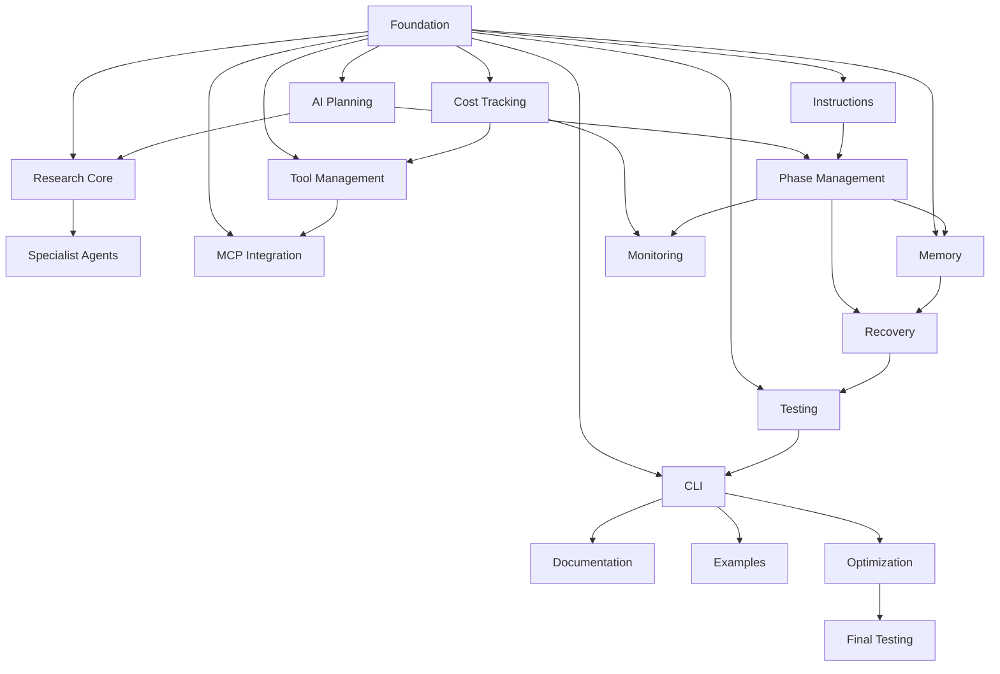

# Build Strategy - Claude Code Builder v3.0

## Executive Summary
The build process is divided into 18 phases, carefully orchestrated to create a robust, feature-complete project builder. The plan emphasizes early foundation work, parallel development where possible, and comprehensive testing throughout.

## Phase Dependencies

## Risk Mitigation Strategies

### Technical Risks
- Complex agent coordination: Implement robust message passing and state management
- Performance bottlenecks: Continuous monitoring and optimization
- Memory management: Implement efficient storage and cleanup
- API reliability: Add retry mechanisms and fallbacks

### Integration Risks
- Component coupling: Strong interfaces and validation
- Version conflicts: Strict dependency management
- Data consistency: Transaction-like updates
- Error propagation: Comprehensive error handling

## Testing Approach

### Unit Testing
- All components individually tested
- Mock external dependencies
- Edge case coverage
- Error handling verification

### Integration Testing
- Component interaction validation
- End-to-end workflows
- Resource management
- Error recovery

### Functional Testing
- Real-world scenarios
- Performance benchmarks
- Resource utilization
- User workflows

## Success Metrics

### Quality Metrics
- Code coverage: >80%
- Test success rate: >95%
- Performance benchmarks met
- Zero critical bugs

### Functional Metrics
- All features implemented
- Documentation complete
- Examples working
- Installation successful

### Performance Metrics
- Build time: 25-45 minutes
- Memory usage within limits
- API costs optimized
- Response times acceptable