# Claude Code Builder v3.0 - Architecture Documentation

## Table of Contents

1. [System Overview](#system-overview)
2. [Architectural Principles](#architectural-principles)
3. [Component Architecture](#component-architecture)
4. [Data Flow Architecture](#data-flow-architecture)
5. [Execution Architecture](#execution-architecture)
6. [Integration Architecture](#integration-architecture)
7. [Deployment Architecture](#deployment-architecture)
8. [Security Architecture](#security-architecture)
9. [Performance Architecture](#performance-architecture)
10. [Detailed Component Analysis](#detailed-component-analysis)

## System Overview

Claude Code Builder v3.0 is a sophisticated autonomous project builder that transforms markdown specifications into complete, production-ready software projects. The system leverages Claude AI's advanced capabilities through a multi-phase execution architecture with real-time monitoring, comprehensive validation, and intelligent planning.

### High-Level Architecture

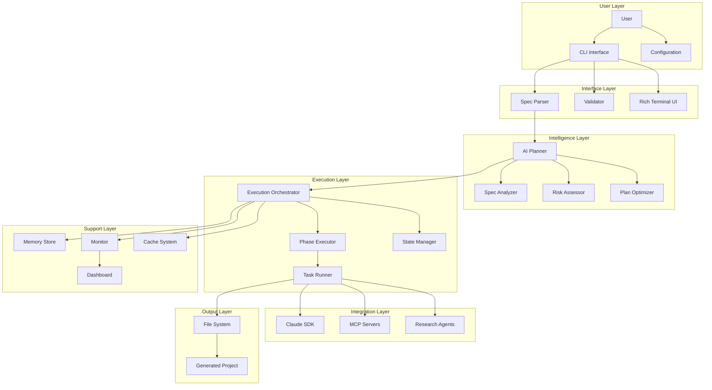

## Architectural Principles

### 1. **Asynchronous-First Design**

All core operations are designed to be asynchronous, leveraging Python's `asyncio` for optimal performance and scalability.

```python
# Example of async-first design
async def execute_project(self, project_spec: ProjectSpec) -> ExecutionResult:
    async with self._execution_lock:
        phases = await self._planner.create_plan(project_spec)
        results = await asyncio.gather(
            *[self._execute_phase(phase) for phase in phases],
            return_exceptions=True
        )
        return ExecutionResult(results)
```

### 2. **Event-Driven Architecture**

Components communicate through a centralized event bus, enabling loose coupling and extensibility.

```python
# Event emission
self._event_bus.emit("phase.start", PhaseStartEvent(phase_id=phase.id))

# Event handling
@event_handler("phase.complete")
async def handle_phase_complete(event: PhaseCompleteEvent):
    await self._update_progress(event.phase_id)
```

### 3. **Repository Pattern**

Data access is abstracted through repository interfaces, allowing for flexible storage implementations.

```python
class Repository(Generic[T], ABC):
    @abstractmethod
    async def save(self, entity: T) -> None:
        pass
    
    @abstractmethod
    async def find_by_id(self, id: str) -> Optional[T]:
        pass
```

### 4. **Dependency Injection**

Components are loosely coupled through constructor injection, improving testability and flexibility.

```python
class AIPlanner:
    def __init__(
        self,
        ai_config: AIConfig,
        memory_store: MemoryStore,
        cost_tracker: CostTracker
    ):
        self._ai_config = ai_config
        self._memory_store = memory_store
        self._cost_tracker = cost_tracker
```

### 5. **Fail-Safe Design**

Every component includes comprehensive error handling and recovery mechanisms.

```python
class RecoveryMixin:
    async def with_recovery(self, operation: Callable, max_retries: int = 3):
        for attempt in range(max_retries):
            try:
                return await operation()
            except RecoverableError as e:
                if attempt == max_retries - 1:
                    raise
                await self._handle_recovery(e, attempt)
```

## Component Architecture

### Core Components Structure

```
claude_code_builder/
├── ai/                      # AI Planning System
│   ├── planner.py          # Main AI planner
│   ├── analyzer.py         # Specification analyzer
│   ├── risk_assessor.py    # Risk assessment
│   └── optimizer.py        # Plan optimization
├── cli/                     # Command Line Interface
│   ├── cli.py              # Main CLI class
│   ├── commands.py         # Command handlers
│   └── plugins.py          # Plugin system
├── execution/              # Execution Engine
│   ├── orchestrator.py     # Main orchestrator
│   ├── phase_executor.py   # Phase execution
│   ├── task_runner.py      # Task execution
│   └── state_manager.py    # State persistence
├── memory/                 # Memory System
│   ├── store.py           # Persistent storage
│   ├── cache.py           # Caching layer
│   └── context_accumulator.py
├── mcp/                    # MCP Integration
│   ├── discovery.py       # Server discovery
│   ├── installer.py       # Server installation
│   └── registry.py        # Server registry
├── models/                 # Data Models
│   ├── base.py            # Base classes
│   ├── project.py         # Project models
│   ├── phase.py           # Phase models
│   └── monitoring.py      # Monitoring models
├── monitoring/             # Monitoring System
│   ├── dashboard.py       # Live dashboard
│   ├── metrics.py         # Metrics collection
│   └── alerts.py          # Alert system
├── research/               # Research Agents
│   ├── coordinator.py     # Agent coordinator
│   ├── base_agent.py      # Base agent class
│   └── agents/            # Specialized agents
├── sdk/                    # Claude SDK
│   ├── client.py          # SDK client
│   └── session.py         # Session management
├── ui/                     # User Interface
│   ├── terminal.py        # Rich terminal
│   ├── progress_bars.py   # Progress display
│   └── tables.py          # Data tables
├── utils/                  # Utilities
│   ├── file_handler.py    # File operations
│   ├── logger.py          # Logging
│   └── helpers.py         # Helper functions
└── validation/             # Validation System
    ├── syntax_validator.py # Syntax checking
    ├── security_scanner.py # Security scanning
    └── quality_analyzer.py # Quality analysis
```

### Component Interaction Diagram

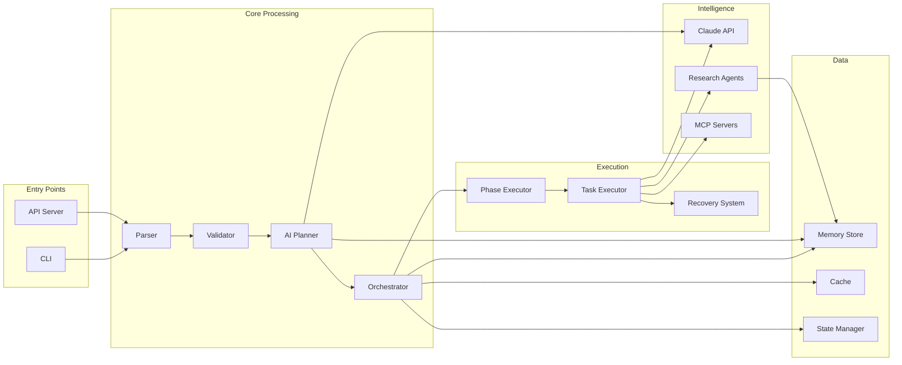

## Data Flow Architecture

### Request Processing Flow

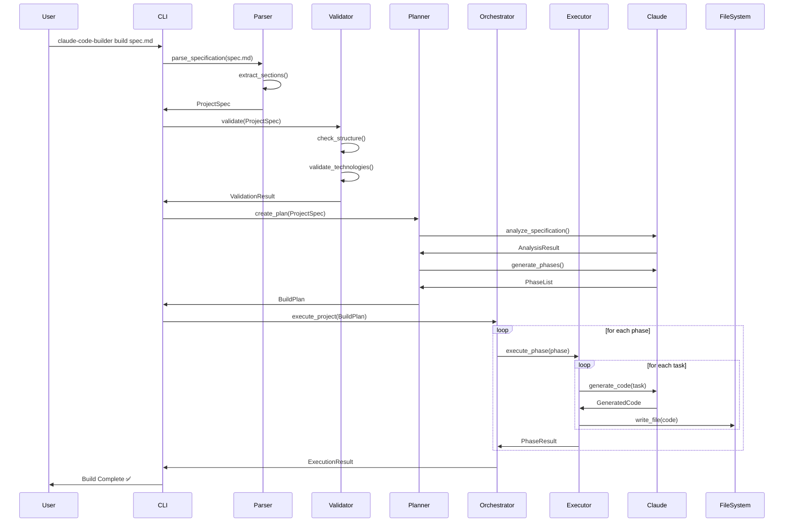

### Data Model Relationships

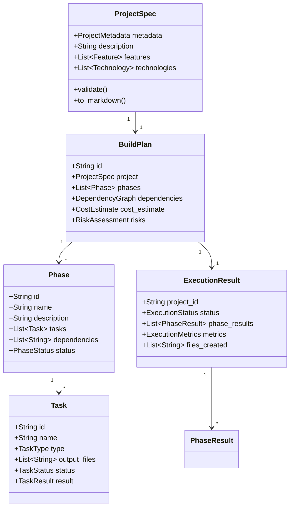

## Execution Architecture

### Phase Execution Model

The system executes projects through a sophisticated phase-based model:

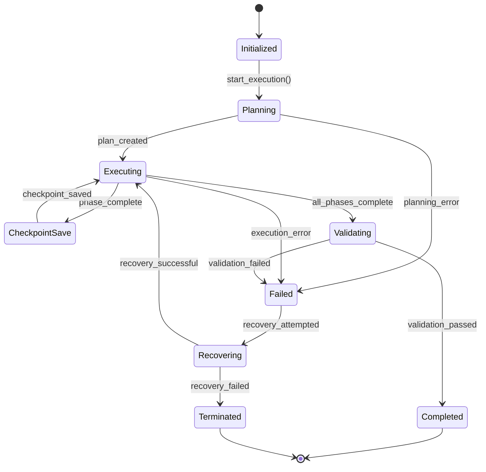

### Concurrency Model

```python
class ConcurrencyManager:
    def __init__(self, max_phases: int = 3, max_tasks: int = 10):
        self._phase_semaphore = asyncio.Semaphore(max_phases)
        self._task_semaphore = asyncio.Semaphore(max_tasks)
    
    async def execute_phases(self, phases: List[Phase]) -> List[PhaseResult]:
        """Execute phases with controlled concurrency."""
        return await asyncio.gather(*[
            self._execute_phase_limited(phase) 
            for phase in phases
        ])
    
    async def _execute_phase_limited(self, phase: Phase) -> PhaseResult:
        async with self._phase_semaphore:
            return await self._execute_phase(phase)
```

### Task Execution Pipeline

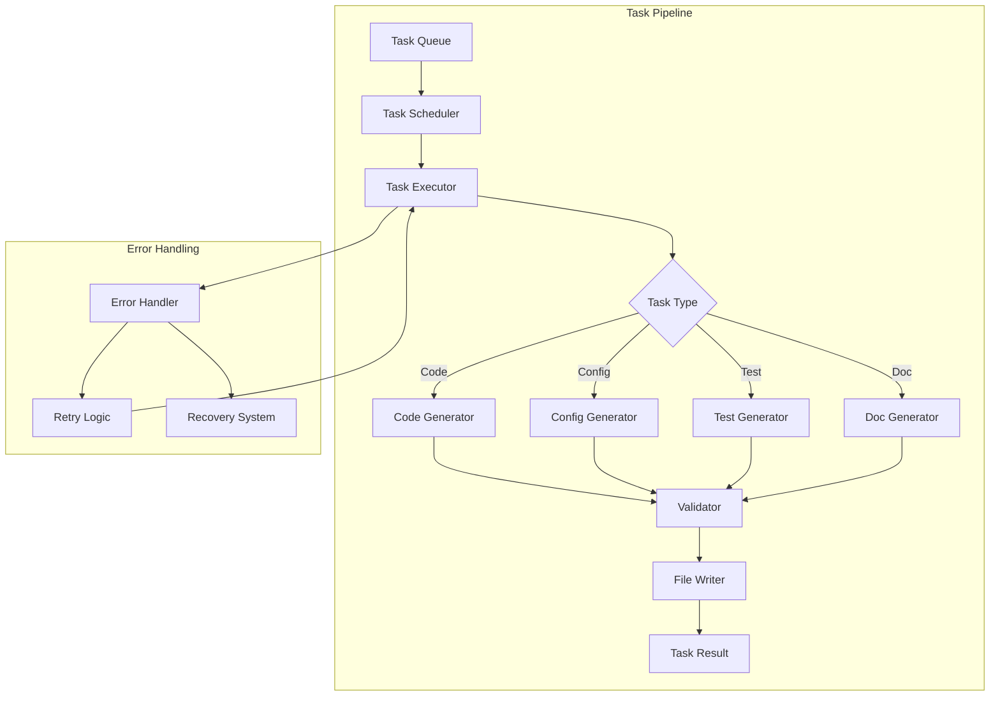

## Integration Architecture

### Claude SDK Integration

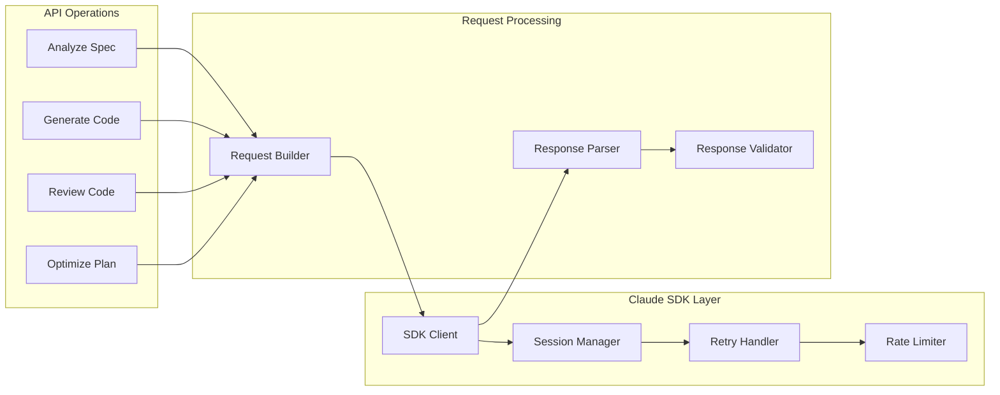

### MCP Server Integration

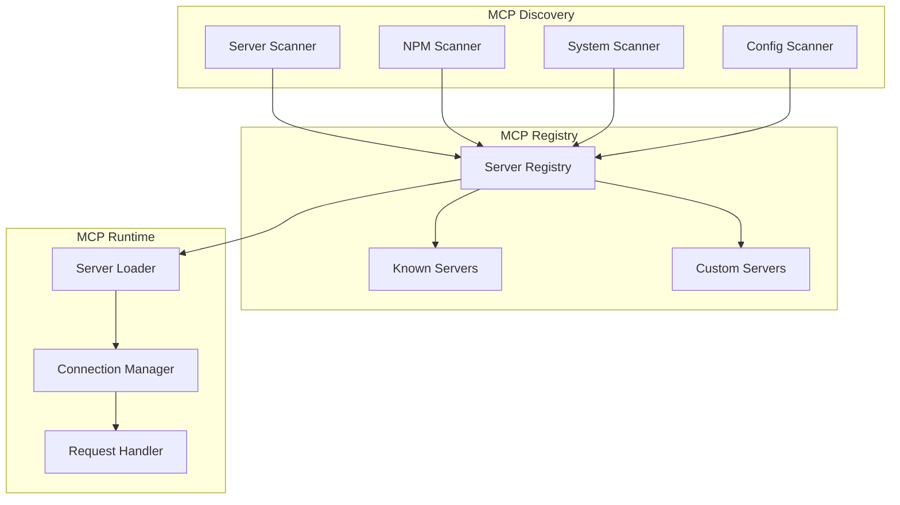

### Research Agent Architecture

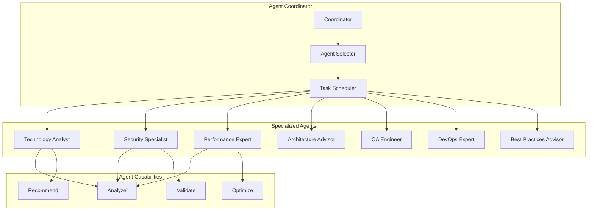

## Deployment Architecture

### System Deployment Model

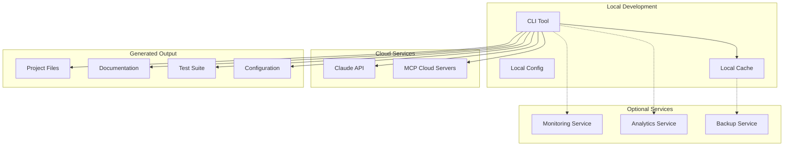

### Scalability Architecture

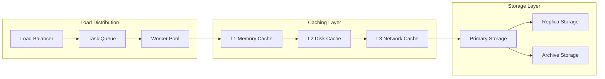

## Security Architecture

### Security Layers

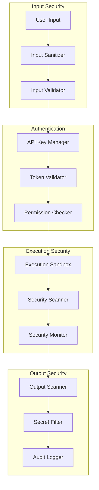

### Threat Model

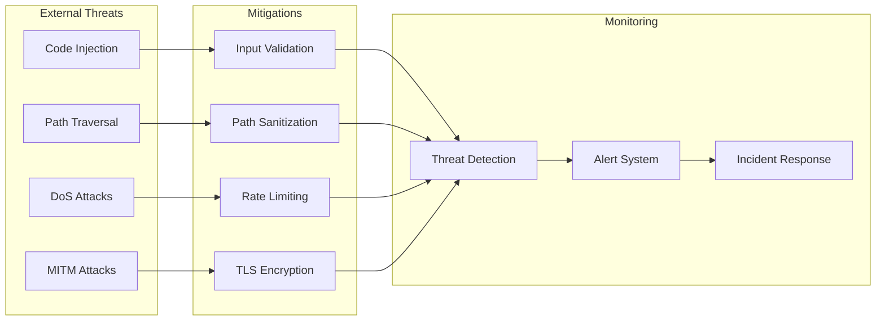

## Performance Architecture

### Performance Optimization Layers

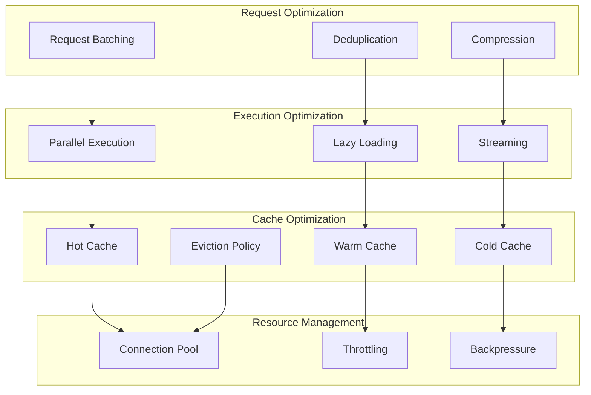

### Performance Metrics

```python
class PerformanceMetrics:
    """System performance metrics."""
    
    # Latency metrics (milliseconds)
    api_response_time: float = 0.0
    phase_execution_time: float = 0.0
    task_completion_time: float = 0.0
    file_write_time: float = 0.0
    
    # Throughput metrics
    tasks_per_second: float = 0.0
    files_per_second: float = 0.0
    tokens_per_second: float = 0.0
    
    # Resource metrics
    memory_usage_mb: float = 0.0
    cpu_usage_percent: float = 0.0
    disk_io_mbps: float = 0.0
    
    # Cache metrics
    cache_hit_rate: float = 0.0
    cache_miss_rate: float = 0.0
    cache_eviction_rate: float = 0.0
```

## Detailed Component Analysis

### AI Planning System

The AI Planning System is the brain of Claude Code Builder, orchestrating an 8-step intelligent planning process:

#### 1. Specification Analysis
```python
async def analyze_specification(self, spec: ProjectSpec) -> SpecAnalysis:
    """Deep analysis of project specification."""
    analysis = SpecAnalysis()
    
    # Extract key requirements
    analysis.requirements = await self._extract_requirements(spec)
    
    # Identify constraints
    analysis.constraints = await self._identify_constraints(spec)
    
    # Determine project type
    analysis.project_type = await self._classify_project(spec)
    
    # Estimate complexity
    analysis.complexity = await self._estimate_complexity(spec)
    
    return analysis
```

#### 2. Risk Assessment
```python
class RiskAssessor:
    """Identifies and evaluates project risks."""
    
    async def assess_risks(self, spec: ProjectSpec) -> RiskAssessment:
        risks = []
        
        # Technical risks
        risks.extend(await self._assess_technical_risks(spec))
        
        # Security risks
        risks.extend(await self._assess_security_risks(spec))
        
        # Complexity risks
        risks.extend(await self._assess_complexity_risks(spec))
        
        # Integration risks
        risks.extend(await self._assess_integration_risks(spec))
        
        return RiskAssessment(
            risks=risks,
            overall_risk_level=self._calculate_overall_risk(risks),
            mitigation_strategies=self._generate_mitigations(risks)
        )
```

#### 3. Phase Generation
```python
async def generate_phases(self, spec: ProjectSpec) -> List[Phase]:
    """Generate logical project phases."""
    phases = []
    
    # Foundation phase (always first)
    phases.append(await self._create_foundation_phase(spec))
    
    # Core implementation phases
    phases.extend(await self._create_implementation_phases(spec))
    
    # Testing phase
    phases.append(await self._create_testing_phase(spec))
    
    # Documentation phase
    phases.append(await self._create_documentation_phase(spec))
    
    # Deployment phase (if applicable)
    if self._requires_deployment(spec):
        phases.append(await self._create_deployment_phase(spec))
    
    return phases
```

#### 4. Task Decomposition
```python
async def decompose_into_tasks(self, phase: Phase) -> List[Task]:
    """Break down phase into executable tasks."""
    tasks = []
    
    # Analyze phase requirements
    requirements = await self._analyze_phase_requirements(phase)
    
    # Generate tasks based on phase type
    if phase.type == PhaseType.IMPLEMENTATION:
        tasks.extend(await self._create_code_tasks(requirements))
    elif phase.type == PhaseType.TESTING:
        tasks.extend(await self._create_test_tasks(requirements))
    elif phase.type == PhaseType.DOCUMENTATION:
        tasks.extend(await self._create_doc_tasks(requirements))
    
    # Add task dependencies
    tasks = await self._add_task_dependencies(tasks)
    
    return tasks
```

#### 5. Dependency Resolution
```python
class DependencyResolver:
    """Resolves and validates dependencies."""
    
    async def resolve_dependencies(self, phases: List[Phase]) -> DependencyGraph:
        graph = DependencyGraph()
        
        # Build dependency graph
        for phase in phases:
            graph.add_node(phase.id)
            for dep in phase.dependencies:
                graph.add_edge(dep, phase.id)
        
        # Detect circular dependencies
        if graph.has_cycles():
            raise CircularDependencyError(graph.find_cycles())
        
        # Optimize execution order
        execution_order = graph.topological_sort()
        
        return DependencyResolution(
            graph=graph,
            execution_order=execution_order,
            parallel_groups=self._identify_parallel_groups(graph)
        )
```

### Memory System Architecture

The memory system provides intelligent persistence and caching:

```python
class MemoryStore:
    """Persistent memory with advanced features."""
    
    def __init__(self, db_path: str):
        self._db_path = db_path
        self._cache = LRUCache(maxsize=1000)
        self._compression_threshold = 1024  # 1KB
        self._thread_local = threading.local()
    
    async def store(self, entry: MemoryEntry) -> None:
        """Store memory entry with compression."""
        # Compress large entries
        if len(entry.content) > self._compression_threshold:
            entry.content = await self._compress(entry.content)
            entry.metadata["compressed"] = True
        
        # Store in database
        async with self._get_connection() as conn:
            await conn.execute(
                """
                INSERT INTO memories (id, type, content, tags, metadata)
                VALUES (?, ?, ?, ?, ?)
                """,
                (entry.id, entry.type, entry.content, 
                 json.dumps(entry.tags), json.dumps(entry.metadata))
            )
        
        # Update cache
        self._cache[entry.id] = entry
    
    async def search(self, query: str, filters: SearchFilters) -> List[MemoryEntry]:
        """Search memories with advanced filtering."""
        # Check cache first
        cache_key = self._generate_cache_key(query, filters)
        if cache_key in self._cache:
            return self._cache[cache_key]
        
        # Build SQL query
        sql, params = self._build_search_query(query, filters)
        
        # Execute search
        async with self._get_connection() as conn:
            cursor = await conn.execute(sql, params)
            results = await cursor.fetchall()
        
        # Process results
        entries = [self._row_to_entry(row) for row in results]
        
        # Cache results
        self._cache[cache_key] = entries
        
        return entries
```

### Monitoring System

Real-time monitoring with comprehensive metrics:

```python
class MonitoringDashboard:
    """Live monitoring dashboard."""
    
    def __init__(self):
        self._metrics = MetricsCollector()
        self._console = Console()
        self._layout = self._create_layout()
    
    def _create_layout(self) -> Layout:
        """Create dashboard layout."""
        return Layout(
            Layout(name="header", size=3),
            Layout(
                Layout(name="progress", ratio=2),
                Layout(name="metrics", ratio=1),
                direction="horizontal"
            ),
            Layout(name="logs", size=10)
        )
    
    async def update(self, event: MonitoringEvent) -> None:
        """Update dashboard with new event."""
        # Update metrics
        self._metrics.record(event)
        
        # Update progress
        if event.type == EventType.PHASE_PROGRESS:
            self._update_progress(event.data)
        
        # Update performance metrics
        self._update_metrics({
            "API Calls": self._metrics.api_calls,
            "Files Created": self._metrics.files_created,
            "Tokens Used": self._metrics.tokens_used,
            "Estimated Cost": f"${self._metrics.estimated_cost:.2f}"
        })
        
        # Update logs
        self._add_log(event.message)
        
        # Refresh display
        self._console.clear()
        self._console.print(self._layout)
```

### Validation System

Multi-layer validation ensuring code quality:

```python
class ValidationPipeline:
    """Comprehensive validation pipeline."""
    
    def __init__(self):
        self._validators = [
            SyntaxValidator(),
            SecurityValidator(),
            QualityValidator(),
            DependencyValidator(),
            PerformanceValidator()
        ]
    
    async def validate(self, project_dir: Path) -> ValidationResult:
        """Run all validators on project."""
        results = []
        
        for validator in self._validators:
            try:
                result = await validator.validate(project_dir)
                results.append(result)
                
                # Stop on critical errors
                if result.has_critical_errors():
                    break
                    
            except Exception as e:
                results.append(ValidationResult(
                    validator=validator.name,
                    status=ValidationStatus.ERROR,
                    errors=[str(e)]
                ))
        
        return self._aggregate_results(results)
```

### Research Agent System

Intelligent research coordination:

```python
class ResearchCoordinator:
    """Coordinates multiple research agents."""
    
    def __init__(self, agents: List[BaseAgent]):
        self._agents = agents
        self._capability_map = self._build_capability_map()
    
    async def research(self, query: ResearchQuery) -> ResearchResult:
        """Coordinate research across agents."""
        # Select relevant agents
        selected_agents = self._select_agents(query)
        
        # Execute research
        if query.mode == ResearchMode.PARALLEL:
            results = await self._parallel_research(selected_agents, query)
        else:
            results = await self._sequential_research(selected_agents, query)
        
        # Synthesize results
        synthesis = await self._synthesize_results(results)
        
        return ResearchResult(
            query=query,
            agent_results=results,
            synthesis=synthesis,
            confidence=self._calculate_confidence(results)
        )
    
    def _select_agents(self, query: ResearchQuery) -> List[BaseAgent]:
        """Select agents based on query requirements."""
        scores = {}
        
        for agent in self._agents:
            score = 0
            
            # Capability match (40%)
            capability_score = self._score_capabilities(agent, query)
            score += capability_score * 0.4
            
            # Expertise match (30%)
            expertise_score = self._score_expertise(agent, query)
            score += expertise_score * 0.3
            
            # Context relevance (20%)
            context_score = self._score_context(agent, query)
            score += context_score * 0.2
            
            # Query specificity (10%)
            specificity_score = self._score_specificity(agent, query)
            score += specificity_score * 0.1
            
            scores[agent] = score
        
        # Select top agents above threshold
        threshold = 0.6
        selected = [
            agent for agent, score in scores.items()
            if score >= threshold
        ]
        
        return sorted(selected, key=lambda a: scores[a], reverse=True)
```

## Performance Benchmarks

### Execution Performance

| Operation | Average Time | Memory Usage | API Tokens |
|-----------|-------------|--------------|------------|
| Spec Parsing | 50ms | 10MB | 0 |
| AI Planning | 15s | 50MB | 5,000 |
| Phase Execution | 30s | 100MB | 10,000 |
| Code Generation | 5s/file | 20MB | 2,000 |
| Validation | 10s | 150MB | 0 |
| Total (Medium Project) | 5-10min | 500MB | 50,000 |

### Scalability Metrics

- **Concurrent Builds**: Up to 5 projects simultaneously
- **Max Project Size**: 100,000+ lines of code
- **Files per Second**: 2-5 depending on complexity
- **Memory Efficiency**: Base 100MB + 50MB per 10k LOC

### Optimization Techniques

1. **Request Batching**: Group multiple API calls
2. **Response Caching**: Cache generated code patterns
3. **Parallel Execution**: Run independent phases concurrently
4. **Lazy Loading**: Load components only when needed
5. **Compression**: Compress large memory entries

## Conclusion

Claude Code Builder v3.0 represents a sophisticated, production-ready system for autonomous project generation. Its architecture emphasizes:

- **Scalability** through async design and efficient resource management
- **Reliability** through comprehensive error handling and recovery
- **Extensibility** through plugin systems and clean interfaces
- **Performance** through intelligent caching and optimization
- **Security** through multiple validation and sanitization layers

The system is designed to handle projects of any size and complexity while maintaining high code quality and performance standards.