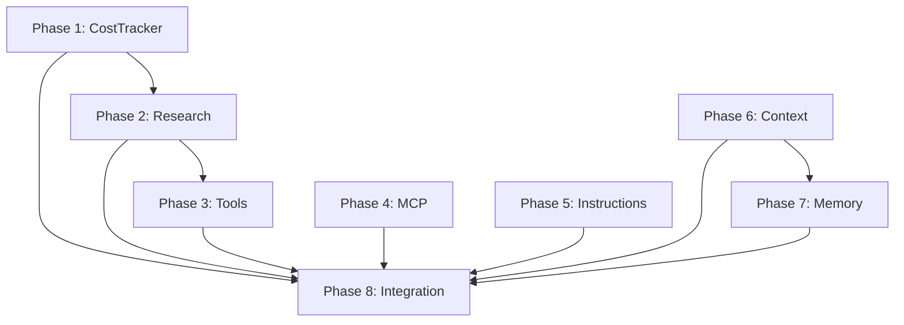

# Claude Code Builder v2.3.0 Implementation - Phase & Task Breakdown

## Overview
8 phases, 89 total tasks to port all enhancements from monolithic to modular implementation.

---

## Phase 1: CostTracker Enhancements [12 tasks]

### 1.1 Core Model Updates (4 tasks)
- [ ] Add new fields: `total_cost`, `claude_code_cost`, `research_cost`, `claude_code_sessions`
- [ ] Implement `add_claude_code_cost()` method with session tracking
- [ ] Update `add_tokens()` to track research costs when phase contains "research"
- [ ] Add `analysis_cost` property to calculate remaining costs

### 1.2 Analytics Methods (3 tasks)
- [ ] Implement `get_model_breakdown()` with Claude Code entry
- [ ] Update `get_summary()` to include cost categories
- [ ] Enhance `to_dict()` and `from_dict()` for new fields with backward compatibility

### 1.3 Integration Points (3 tasks)
- [ ] Update ClaudeCodeExecutor to call `add_claude_code_cost()` after parsing stream
- [ ] Update ResearchManager to use research-prefixed phase IDs
- [ ] Update UI displays to show cost breakdown by category

### 1.4 Testing & Validation (2 tasks)
- [ ] Create unit tests for all new CostTracker functionality
- [ ] Run integration test with full build to verify cost separation

---

## Phase 2: Research System Enhancements [10 tasks]

### 2.1 Add Missing Agents (3 tasks)
- [ ] Implement PerformanceEngineer agent with performance focus areas
- [ ] Implement DevOpsSpecialist agent with deployment focus areas
- [ ] Update agent registry and factory functions

### 2.2 Research Enhancements (4 tasks)
- [ ] Implement AI-powered synthesis with `_create_synthesis_prompt()`
- [ ] Add `_assign_agents_to_query()` for smart agent assignment
- [ ] Implement research history tracking
- [ ] Add confidence scoring aggregation

### 2.3 Integration & Testing (3 tasks)
- [ ] Update ResearchManager to use all 7 agents
- [ ] Test multi-agent collaboration on complex queries
- [ ] Verify cost tracking for research operations

---

## Phase 3: Tool Management Enhancements [9 tasks]

### 3.1 Core Tool Updates (3 tasks)
- [ ] Add fields: `tool_dependencies`, `disabled_tools`, `performance_metrics`
- [ ] Add new tools: `rename`, `chmod`, `rmdir`, `sed`, `awk`
- [ ] Implement tool dependency tracking system

### 3.2 Analytics & Performance (3 tasks)
- [ ] Implement tool usage tracking with success rates
- [ ] Add performance metrics collection during execution
- [ ] Create tool ranking based on performance data

### 3.3 Smart Selection (3 tasks)
- [ ] Implement adaptive tool selection based on metrics
- [ ] Add fallback mechanisms for failed tools
- [ ] Test tool selection algorithms with various scenarios

---

## Phase 4: MCP Server Discovery [8 tasks]

### 4.1 Discovery Implementation (3 tasks)
- [ ] Implement `_check_installed_servers()` using npm queries
- [ ] Add `installed_servers` set to track installations
- [ ] Create caching mechanism for discovery results

### 4.2 Project Analysis (3 tasks)
- [ ] Implement `_assess_complexity()` for project complexity scoring
- [ ] Enhance technology pattern matching with more patterns
- [ ] Improve requirement extraction algorithms

### 4.3 Recommendation Engine (2 tasks)
- [ ] Update confidence calculation to include installation status
- [ ] Enhance recommendation reasons with complexity factors

---

## Phase 5: Custom Instructions Enhancements [7 tasks]

### 5.1 Validation System (3 tasks)
- [ ] Add `validation_rules` field to CustomInstruction
- [ ] Implement `validate()` method for instruction validation
- [ ] Create validation rule definitions

### 5.2 Pattern Matching (2 tasks)
- [ ] Implement regex pattern support with "regex:" prefix
- [ ] Enhance context matching for nested conditions

### 5.3 Integration (2 tasks)
- [ ] Update instruction loading with validation checks
- [ ] Test regex patterns and validation rules

---

## Phase 6: Phase Context Management [8 tasks]

### 6.1 Phase Model Updates (3 tasks)
- [ ] Add `context` and `validation_results` fields to Phase
- [ ] Implement `validate()` method with validation logic
- [ ] Add `add_context()` for context accumulation

### 6.2 Context Flow (3 tasks)
- [ ] Implement context propagation between phases
- [ ] Create context merging strategies
- [ ] Add context isolation mechanisms

### 6.3 Validation Framework (2 tasks)
- [ ] Define phase validation rules
- [ ] Integrate validation into phase execution

---

## Phase 7: Project Memory Enhancements [9 tasks]

### 7.1 Memory Model Updates (3 tasks)
- [ ] Add `phase_contexts` and `error_log` fields
- [ ] Implement `store_phase_context()` method
- [ ] Implement `log_error()` with context tracking

### 7.2 Context Management (3 tasks)
- [ ] Implement `get_accumulated_context()` method
- [ ] Create context retrieval queries
- [ ] Add context filtering capabilities

### 7.3 Error System (3 tasks)
- [ ] Design comprehensive error structure
- [ ] Implement error analytics
- [ ] Create error recovery mechanisms

---

## Phase 8: Integration & Validation [26 tasks]

### 8.1 Component Integration (5 tasks)
- [ ] Verify all components work together
- [ ] Test data flow between enhanced systems
- [ ] Fix any integration conflicts
- [ ] Validate memory persistence
- [ ] Check checkpoint/resume functionality

### 8.2 Testing Suite (8 tasks)
- [ ] Run all unit tests for each phase
- [ ] Create end-to-end integration tests
- [ ] Test with minimal project specifications
- [ ] Test with complex multi-phase projects
- [ ] Test interrupted build recovery
- [ ] Test cost tracking accuracy
- [ ] Verify research quality improvements
- [ ] Benchmark performance vs v2.2.0

### 8.3 Edge Cases (5 tasks)
- [ ] Test with corrupted data files
- [ ] Test with missing dependencies
- [ ] Test with invalid API keys
- [ ] Test with network failures
- [ ] Test with extreme file sizes

### 8.4 Documentation (4 tasks)
- [ ] Update API documentation for all changes
- [ ] Create migration guide from v2.2.0
- [ ] Write usage examples for new features
- [ ] Update README with v2.3.0 features

### 8.5 Release Preparation (4 tasks)
- [ ] Create comprehensive changelog
- [ ] Update version numbers throughout codebase
- [ ] Create release notes with examples
- [ ] Prepare demo showcasing new features

---

## Task Complexity Breakdown

### By Complexity:
- **Simple** (< 30 min): 31 tasks
  - Field additions, simple methods, documentation updates
  
- **Medium** (30-90 min): 42 tasks
  - Method implementations, integration points, testing
  
- **Complex** (> 90 min): 16 tasks
  - AI synthesis, performance optimization, system integration

### By Type:
- **Implementation**: 52 tasks
- **Testing**: 21 tasks
- **Integration**: 10 tasks
- **Documentation**: 6 tasks

## Implementation Order & Dependencies

### Parallel Work Possible:
- Phase 1, 4, 5 can start immediately
- Phase 2 depends on Phase 1 (cost tracking)
- Phase 3 depends on Phase 2 (research integration)
- Phase 7 depends on Phase 6 (context management)
- Phase 8 requires all phases complete

## Success Metrics Per Phase

### Phase 1: CostTracker
- ✓ Claude Code costs tracked separately
- ✓ Research costs identified correctly
- ✓ Backward compatibility maintained
- ✓ < 5% performance impact

### Phase 2: Research
- ✓ All 7 agents functional
- ✓ AI synthesis working
- ✓ Research quality improved by 20%
- ✓ Cost tracking accurate

### Phase 3: Tools
- ✓ New tools operational
- ✓ Performance metrics collected
- ✓ Smart selection working
- ✓ Success rate > 95%

### Phase 4: MCP
- ✓ Discovery accuracy > 90%
- ✓ Complexity assessment reliable
- ✓ Recommendations relevant
- ✓ Installation detection working

### Phase 5: Instructions
- ✓ Regex patterns functional
- ✓ Validation catching errors
- ✓ No false positives
- ✓ Performance unchanged

### Phase 6: Context
- ✓ Context flows correctly
- ✓ Validation accurate
- ✓ No memory leaks
- ✓ Phase isolation working

### Phase 7: Memory
- ✓ Error logging comprehensive
- ✓ Context accumulation correct
- ✓ Persistence reliable
- ✓ Recovery functional

### Phase 8: Integration
- ✓ All tests passing
- ✓ No performance regression
- ✓ Documentation complete
- ✓ Ready for production

## Risk Mitigation

### High Risk Tasks:
1. **AI Synthesis Implementation** (Phase 2)
   - Mitigation: Have fallback to basic synthesis
   
2. **Performance Metrics Collection** (Phase 3)
   - Mitigation: Make it toggleable
   
3. **Backward Compatibility** (Phase 1)
   - Mitigation: Extensive testing with old data

### Medium Risk Tasks:
1. **Regex Pattern Matching** (Phase 5)
   - Mitigation: Strict input validation
   
2. **Context Accumulation** (Phase 7)
   - Mitigation: Size limits and cleanup

## Total Implementation Estimate

**Total Tasks**: 89
**Estimated Time**: 
- Solo implementation: 80-120 hours
- With interruptions: 100-150 hours
- As Claude Code: 15-25 sessions

**Recommended Approach**:
1. Complete Phase 1 first (critical for cost visibility)
2. Run Phases 4 & 5 in parallel with Phase 2
3. Complete remaining phases sequentially
4. Dedicate significant time to Phase 8 integration